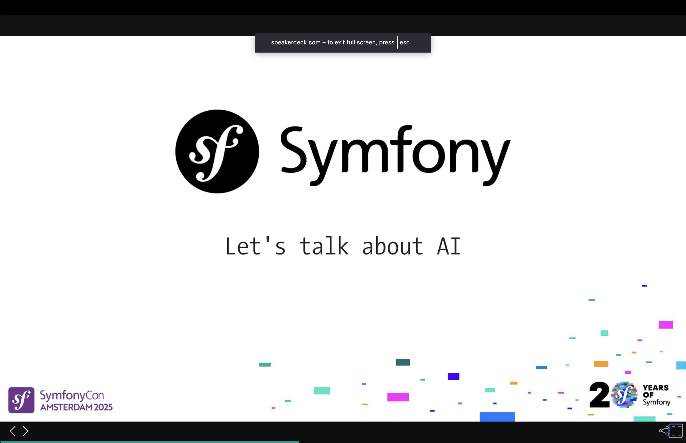
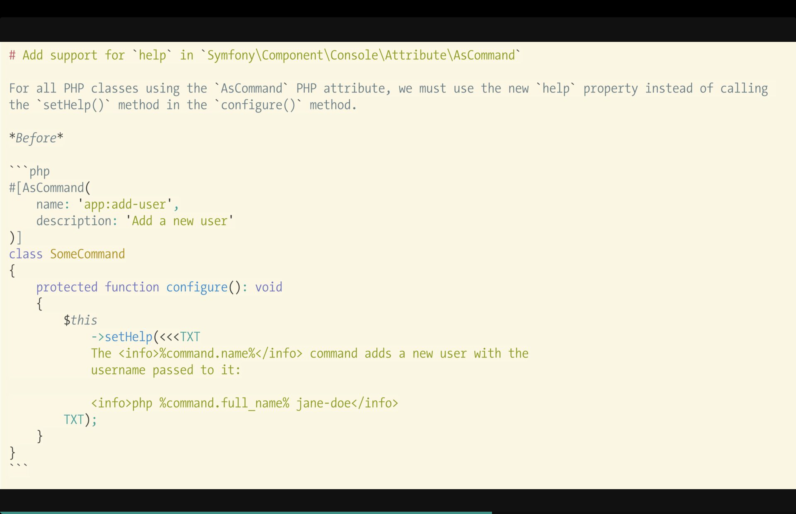
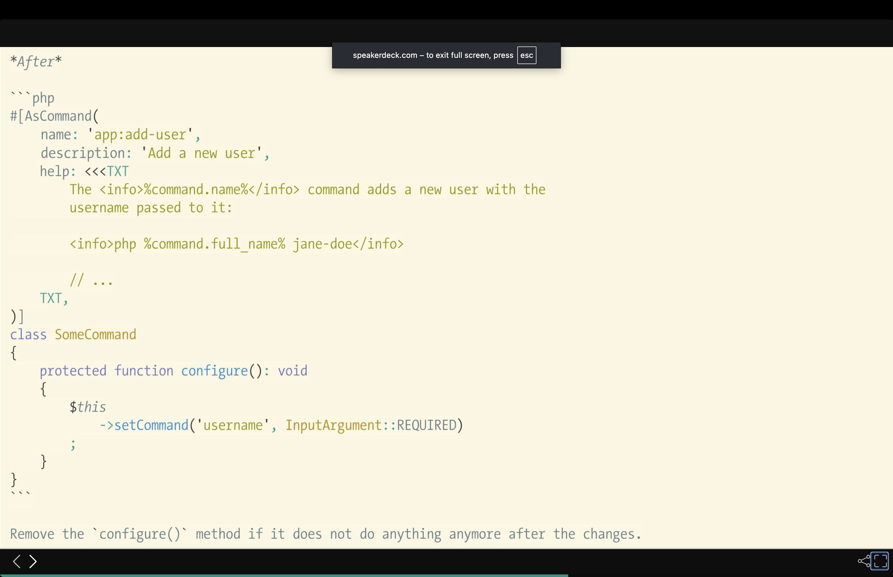
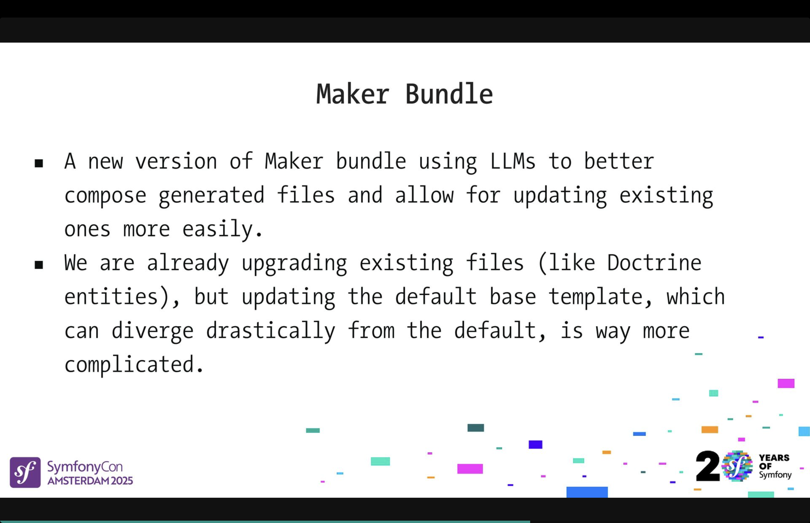
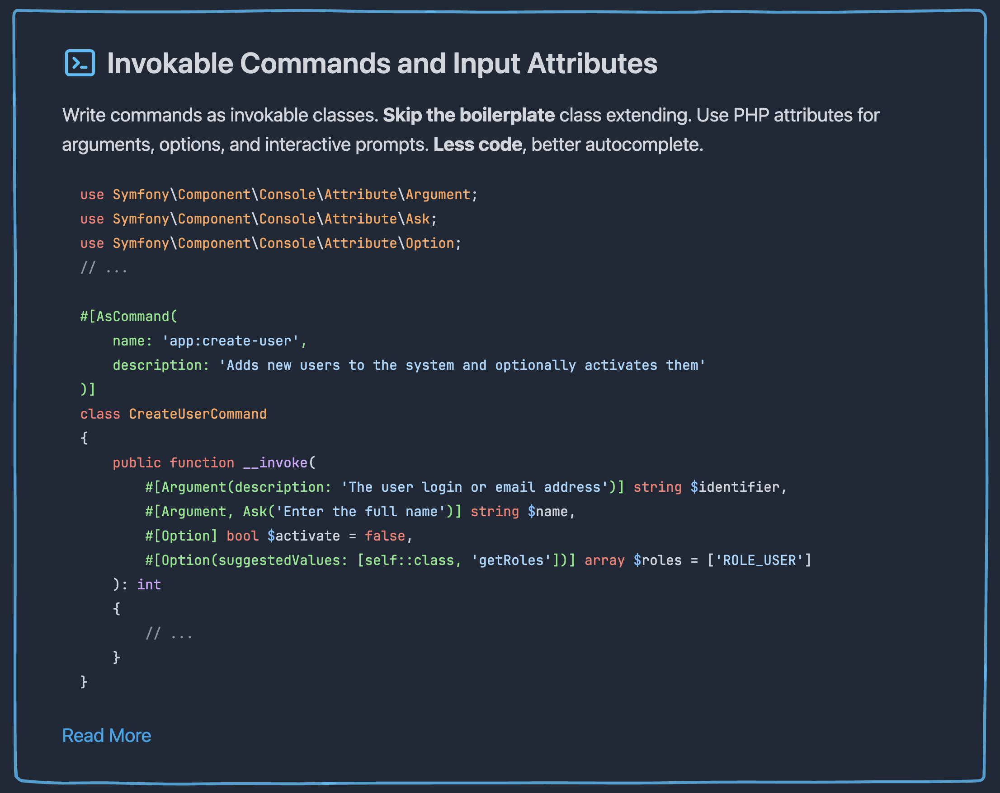
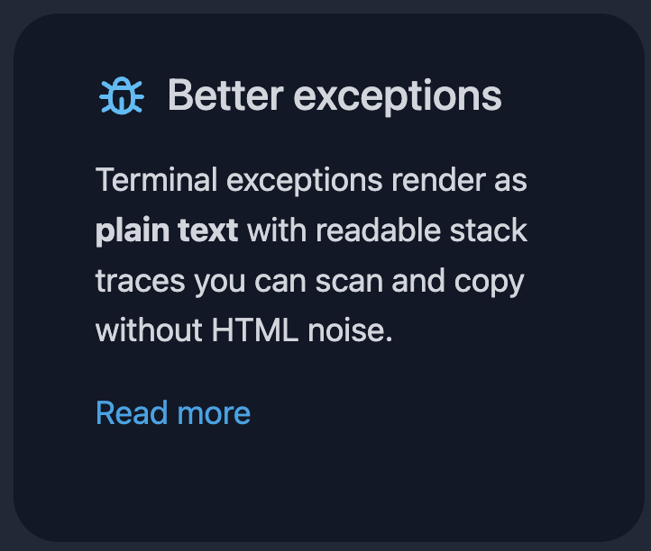

# 20 Years of Symfony, What's Next?

Speaker: Fabien Potencier
* [Video](https://www.youtube.com/watch?v=_UU_ZIwgBv0)

## Recap

Fabien Potencier's keynote at SymfonyCon Amsterdam 2025 is a celebration, a live release, and a manifesto rolled into one. The occasion is twenty years of Symfony as a public project, twenty-one for Fabien personally, who started writing it in July 2004. The first commit landed in Subversion in October 2005. In the two decades since, the framework has been rebuilt once (Symfony 2.0, 2011), gained a flexible installer (Flex, 2017), launched a learning platform (SymfonyCasts, 2019), and grown into something that is difficult to fully measure.

### Symfony is a de facto PHP standard library

Symfony publishes a live download counter at symfony.com/stats. The number sits at around 25 million downloads per day. Fabien admits the raw figure is noisy: CI pipelines, test runs, and demo environments all inflate it. What he finds more revealing is the proportional view.

Symfony ships 282 packages from its monorepo and its poly-repo splits. That is 0.06% of all packages on Packagist. Packagist records roughly 3 billion installs per month. Running the maths gives a striking result: **Symfony packages account for approximately 25% of all PHP package installs worldwide.** Fabien rechecked the arithmetic ten times. The core of Symfony is its components, not the full-stack framework, and those components are embedded inside Laravel, API Platform, Composer itself, and virtually every major PHP project.

Each major version adds new components. Symfony 2 shipped with 21. With each release since, the count grows by five or six. Symfony 8 is no exception: it introduces **Emoji, JsonPath, JsonStreamer, ObjectMapper, and TypeInfo**.

Beyond components, Symfony maintains 111 integration bridges spanning notifier, mailer, messenger, translation, and lock. Each release now produces around 180 tags across the monorepo and its subtree splits.

### Live on stage: releasing Symfony 8

Six years ago in Amsterdam, Fabien released Symfony 5 live on stage. He decided to do the same for Symfony 8.

It almost went badly. An hour before the keynote, he restarted the git subtree splitter (hosted on upsun) and picked a command from his shell history, one that included a `--scratch` flag, meaning "delete everything and start over." That flag triggered a full reprocessing of fifteen years of commits, a job that takes about a day. **In more than thirty years of software development, this was the first time Fabien had successfully restored from a backup.** He credits upsun for keeping one.

The release itself proceeded live from the stage: preparing the 8.0 branch, generating the changelog from structured commit messages, crediting sponsors (PhpStorm, Sulu, redirection.io, Private Packagist, SensioLabs), tagging the monorepo, syncing tags to all 180 subtree-split repositories, creating GitHub releases, and publishing the blog post. By the time the talk reached its final section, `symfony new myapp` was already resolving to a Symfony 8 skeleton.

### Let's talk about AI

Fabien uses LLMs daily, primarily Claude Code and Cursor. His honest assessment: he discards most of the generated code and uses it as a starting point, especially for JavaScript where he is outside his comfort zone. But the question he has been asking himself is whether the repetitive, low-value tasks he feeds to an LLM interactively could be packaged into automated agents.

His requirements for such an agent: controllable output, near-100% accuracy, cheap (favoring smaller or local models over frontier ones), and no vendor lock-in. He is deliberately avoiding features specific to Cursor or Claude Code so that the same approach could run on any model.

#### Can AI improve the Symfony developer experience?

**Upgrading code** is the clearest opportunity. Every minor Symfony release deprecates things. Existing tools like Rector help, but their coverage is uneven, and authoring rules requires significant effort. An LLM guided by a well-scoped context can handle cases that are too varied or too contextual for static analysis.

The secret is **building a deterministic context**. Rather than letting the LLM search the codebase freely (which costs tokens and time), Symfony already knows which commands exist, which services are registered, and which routes are declared. A purpose-built tool can hand the LLM exactly the files relevant to a specific deprecation, nothing more.

The guide format that powers this is intentionally minimal: a short Markdown file, one per deprecation, containing a one-sentence description and a before/after code snippet.

The example Fabien walks through is the `setHelp()` deprecation: commands using the `#[AsCommand]` attribute should now declare their help text as a property of that attribute rather than calling `$this->setHelp()` in `configure()`. The LLM understands the constraint: if the help string references a dynamic variable, the migration is not safe and should be skipped. If `configure()` becomes empty after the change, it should be removed entirely. A focused task, a focused context, a reliable result.

**Maker Bundle** is another candidate. It already scaffolds controllers, commands, and entities. The current limitation is composability: when you need to support multiple ORMs or multiple template engines, static templates become unmanageable. An LLM can compose from snippets instead: "here is how to add a Doctrine getter; here is what changes if you are on PHP 8.x with attributes", and assemble the result correctly for the project's actual configuration. Updating existing files, which Maker does not handle well today, is where this approach adds the most value.

**`recipes:update`** has a similar gap. The command updates Flex recipe files, but leaves conflicts for the developer to resolve manually. An LLM familiar with the project's current configuration can handle those conflicts, and could go further: enabling composable recipes, where a third-party bundle contributes to a shared config file like the security configuration rather than shipping a standalone fragment.

**Debugging** is where Symfony's existing instrumentation becomes an asset. The profiler already captures logs, exception messages, container metadata, and route tables for every request. All of that is structured data. Feeding a profiler token to an LLM alongside the relevant source files gives it the precise context it needs to diagnose a problem without any free-form search.

#### The principles behind making it work

Splitting work into narrow, well-defined tasks improves accuracy and reduces hallucination. A task description that does not make sense to a human is a signal that the context is too noisy. **Anything optimized for an LLM is also optimized for a human.** The two audiences have the same needs: clear descriptions, concrete examples, minimal irrelevant detail.

Structured output helps too. The code Symfony works with (PHP, YAML, JSON) can be validated syntactically and semantically after generation. Running the test suite provides an additional signal. Feeding errors back to the LLM in a correction loop, with an LLM-as-judge step at the end to check stylistic alignment with the project, pushes smaller models toward the accuracy of frontier models.

#### Using Symfony to build AI applications

Fabien makes the case that Symfony is already well-equipped for building AI-powered applications. Most LLM interactions are HTTP calls with streaming responses, straightforward territory for the HttpClient component. Twig is a natural fit for composing dynamic prompts that incorporate RAG context or user-provided variables. The Workflow component maps onto multi-step agent pipelines. The Process component covers local model execution. The Serializer handles structured LLM outputs.

And there is **Symfony AI**, an incubating project led by Chris Liddell and Oscar Codesal that brings dedicated LLM abstractions directly into the Symfony ecosystem. Fabien describes the volume of work they have put in as "literally crazy." A dedicated keynote by Chris was scheduled for the following morning.

#### Optimizing Symfony itself for the AI world

The last question Fabien raises is whether Symfony should do anything differently now that LLMs are reading its documentation and generating code with it.

The answer, he argues, is mostly about consistency. Symfony already generates machine-readable data about itself: the container, the routes, the CLI command list. That data is gold for an LLM context. **The gap is documentation quality.**

The current CHANGELOG is inconsistent: deprecations sometimes include before/after examples, sometimes do not. Fabien proposes making this systematic: one Markdown file per deprecation, with a clear description and code examples, which can then be aggregated into the CHANGELOG and linked from it.

The same principle applies to pull request descriptions. Fabien ran an experiment eight months ago: he gave Claude a well-written Symfony PR description, one with clear rationale and before/after samples, and asked it to upgrade a project accordingly. It did a good job. **Everything that makes documentation useful for humans makes it equally useful for LLMs**, which means the investment in better docs is never wasted regardless of whether the AI use case materialises.

The hackathon on Saturday was the immediate next step. Fabien invited anyone interested to work together on these prototypes: the upgrade agent, the LLM-powered Maker, the composable recipe resolver. Not a release. A beginning.
