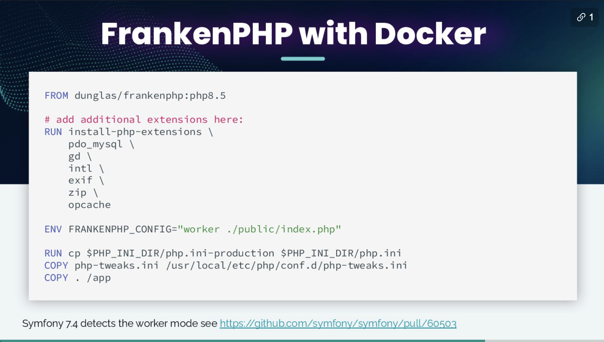
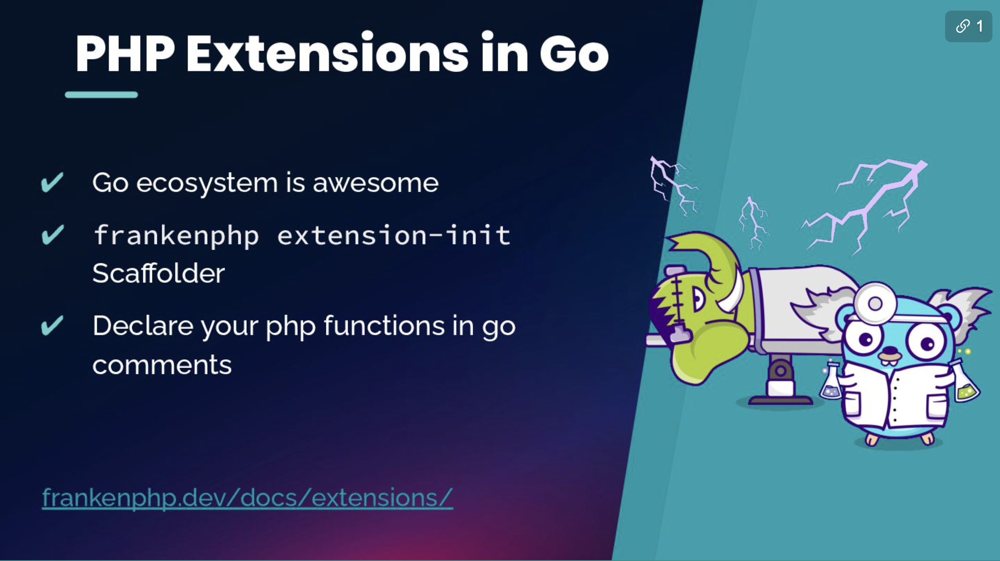
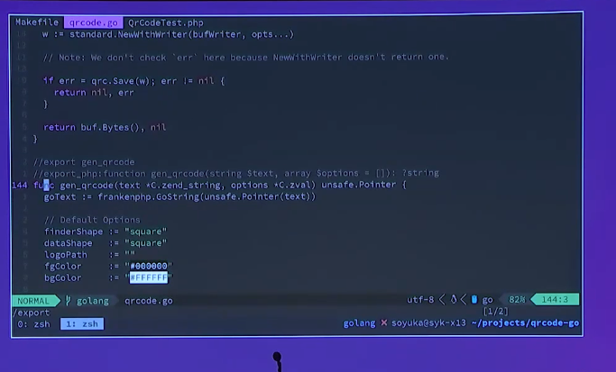

# 2025: Performance Milestone for the Symfony Ecosystem

> **Talk Abstract**
>
> The Symfony ecosystem is constantly evolving to ease developer experience and optimize application efficiency. New Symfony components, such as JSON Streamer, are at the forefront of this evolution, raising the bar for modern web application performance.
>
> We'll take a modern application built with API Platform and supercharge it, showcasing how this new component, along with the efficiency of FrankenPHP in worker mode, can be used to achieve significant performance gains. This talk will provide concrete benchmarks and practical use cases, demonstrating how you can build faster, more efficient applications.

Speaker: Antoine Bluchet
* [Slides](https://speakerdeck.com/soyuka/2025-performance-milestone-for-the-symfony-ecosystem)

## Recap

Antoine Bluchet opens with a moment of collective celebration: twenty years of Symfony. A round of applause is requested, and duly given.

### The trick Symfony components share

The talk pivots quickly from the anniversary to one of the biggest architectural shifts in the framework's history: the gap between Symfony 1 and Symfony 4. Symfony 1 was monolithic and XML-heavy. Symfony 4 introduced Flex and the component model: pick the pieces you need, like Lego, and assemble them into exactly what you want. That shift made the framework more approachable, more adaptable, and meaningfully more performant.

At the core of that performance story is an old trick, introduced as early as Symfony 2 with the **Dependency Injection Container**: compile your configuration into plain PHP, dump it to the `var/cache` folder, and serve it directly from disk on every request. No re-parsing, no re-resolution, just fast PHP. The container code is the same today as it was back then.

What is surprising is how many other components in the ecosystem have adopted the same strategy. Routing dumps its URL matching logic to a generated PHP file. Config, ExpressionLanguage, and Translation all do the same. Twig compiles templates to PHP classes. Each of them trades one-time compilation cost for dramatically faster runtime execution.

### JSON Streamer: the newest addition

The latest component to join this family is **JSON Streamer**, brought to Symfony by Mathias Arlaud. Instead of walking an object graph at runtime and serialising it incrementally, JSON Streamer analyses the structure of your class ahead of time, generates the PHP code that will write the JSON (a sequence of `echo` calls, quoted keys, values), and dumps it to cache. At runtime, streaming is as fast as PHP can execute straight-line code.

The benchmarks Antoine ran on a large collection of products show results that are hard to ignore: JSON Streamer is around **ten times faster** than the Symfony Serializer, with **50% less memory usage**, making it particularly well-suited to large volume responses. A Blackfire comparison on a collection of one million elements shows four seconds less time spent in normalisation.

Beyond raw throughput, the component changes how the browser perceives speed. With traditional serialisation, the entire response must be assembled in memory before the first byte is sent. With streaming, the browser receives and can begin processing JSON immediately. Showing the user the total item count while the rest of the collection is still loading creates a feeling of responsiveness that no amount of server-side tuning can replicate.

The component is not without caveats. If an error occurs mid-stream, the response will stop abruptly and the HTTP 500 page may be appended to the partially-delivered JSON, which is not ideal for clients. Solutions are in progress. JSON Streamer also requires **public properties** on the classes it serialises, since generating static PHP code that reaches into private state would be impractical. Customisation is more involved than writing a custom Normalizer, though the component offers escape hatches.

### Customising the output

Inside API Platform, collections are serialised as JSON-LD, which requires an `@id` field containing a URI rather than a bare identifier. Building that URI at compile time is not possible, since it depends on runtime context. JSON Streamer handles this via two interfaces. A **property metadata loader** declares synthetic properties: fields that have no corresponding class property but will appear in the JSON output. Each synthetic property can be given a type and a **value transformer** that is called at runtime to produce the actual value. The time spent in the transformer is runtime cost and will not be cached, but for a URI built from an API Platform IRI generator, that is exactly the right trade-off.

The component is available in **API Platform 4.2**, where a single `#[JsonStream]` flag enables streaming for a given resource. The public properties requirement still applies.

### Performance improvements still in progress

JSON Streamer is not the only performance work in flight. Two pull requests are worth following.

The first targets the **Object Mapper** component, which is frequently used alongside JSON Streamer to translate Doctrine entities into the flat, public-property structures that streaming requires. The proposed change dumps the mapping logic to PHP at compile time rather than resolving it on every request, for a projected **50% performance improvement** ([PR #52905](https://github.com/symfony/symfony/pull/52905)).

The second targets the **Serializer** itself. Tobias Nyholm is working on a code-generation approach to normalizers, an idea that first appeared as a pull request almost ten years ago and is finally getting serious attention. The projected gain is **87%** ([PR #61515](https://github.com/symfony/symfony/pull/61515)). The difficulty, as Antoine explains, is not technical but human: generated PHP code is opaque and hard to review, which makes it hard to merge. The invitation to the community is direct: go to these pull requests, leave a comment, signal your interest, and help the reviewers feel it is worth the effort.

### FrankenPHP with Docker

Partway through, Antoine introduces himself: he is Antoine Bluchet, known online as Soyuka, the API Platform release manager and CTO at Les-Tilleuls.coop, a cooperative that funds the equivalent of two full-time jobs on open source every year. The context matters because the benchmarks about to follow come from real client work.

A client asked Antoine to speak at a Sylius event and benchmark FrankenPHP. The result became the practical core of this talk. Getting started with FrankenPHP via Docker is straightforward: extend the official image, install the PHP extensions you need, and set a single environment variable to activate worker mode.

One detail worth noting: FrankenPHP exposes its entire configuration through environment variables, which means you can build the image once and change the behaviour (including the number of workers, or whether the worker mode is on at all) simply by relaunching the container with different environment variables. A watch mode is available in development to restart workers automatically on code changes. Antoine points to Kevin Dunglas' talk for the full deep-dive.

Two practical tips: logs should go to stderr (the system default, and Symfony's default too), and tuning the number of workers is a manual process: start low, increment, check CPU and memory saturation, repeat.

The benchmark results, run on a fully hosted environment to avoid laptop interference, tell a clear story. Nginx with PHP-FPM and FrankenPHP without worker mode are **effectively identical** in requests per second. Enable FrankenPHP's worker mode and throughput **roughly doubles**, because the framework container, class autoloading, and bootstrap are kept in memory across requests rather than rebuilt for each one. Latency improves proportionally.

### PHP extensions in Go

The final section is a different kind of performance story. FrankenPHP, being written in Go, supports writing **PHP extensions in Go**, and Antoine finds this genuinely exciting.

The workflow is: write a Go function, add special comments declaring the PHP function signature it should expose, run the `frankenphp extension-init` scaffolder, and then build a custom FrankenPHP binary with `xcaddy`. The resulting binary includes your new PHP function, which calls directly into your Go code.

A client was generating QR codes using a PHP library that was not doing things properly. Antoine took a well-regarded Go QR code library, wrapped it as a PHP extension, and measured the result: **twice as fast, with significantly less memory usage**. A small web interface, built with an LLM ("I'm lazy"), let the audience try it live.

The Go ecosystem's small, fast, composable libraries make the pattern attractive well beyond QR codes. Seeing Go code in Vim at a PHP conference is, admittedly, a little surprising, but it makes the point: PHP developers are not obliged to stay within PHP for everything. The FrankenPHP model means you can be a PHPolyglot, reaching into whatever language solves your problem best and surfacing the result as an ordinary PHP function.

### Conclusion

The through-line of the talk is a single insight that Symfony has been exploiting for fifteen years: if you know the shape of your data at compile time, you can generate the code that handles it and pay the cost once. JSON Streamer, Object Mapper, and the upcoming Serializer work all extend that insight to new surfaces. FrankenPHP's worker mode applies the same logic at the process level, keeping the framework warm across requests. PHP extensions in Go extend it to the language runtime itself.

The tools are here. The benchmarks are concrete. The remaining work is in the pull requests.
