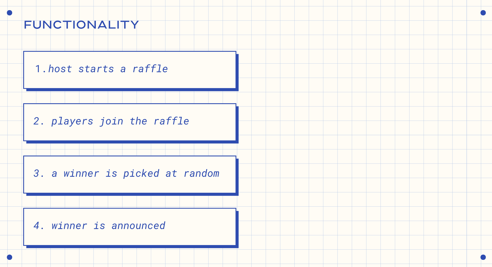
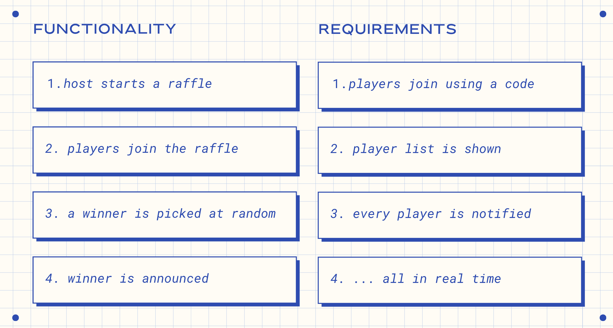
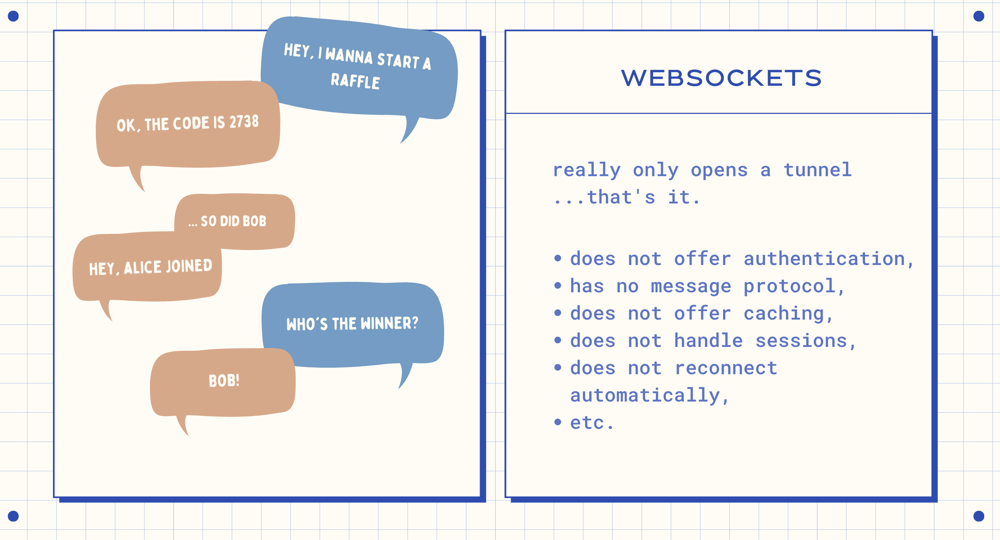
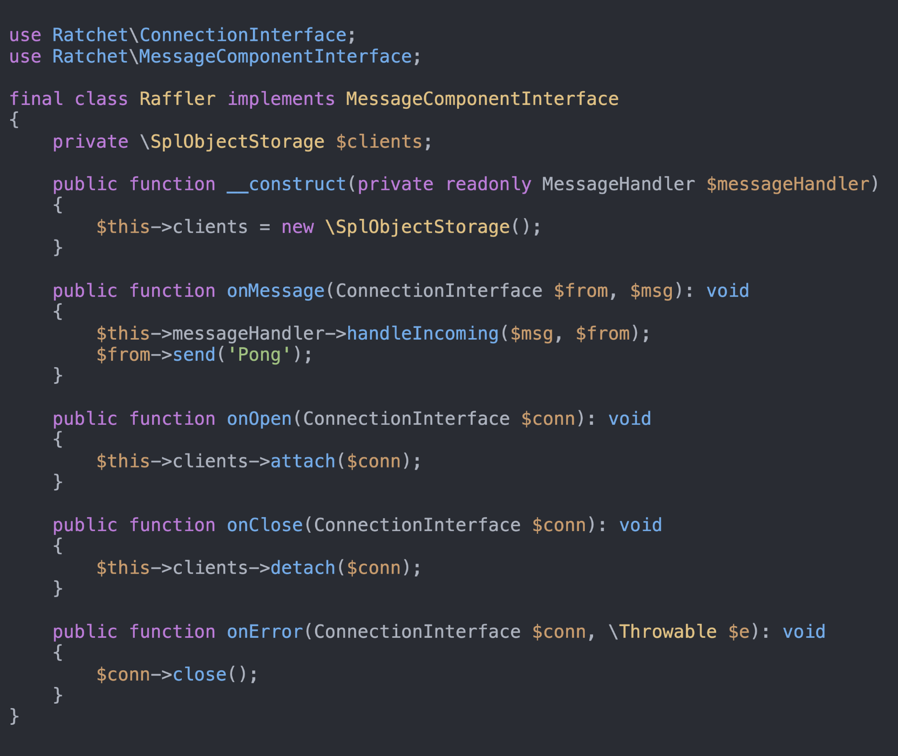
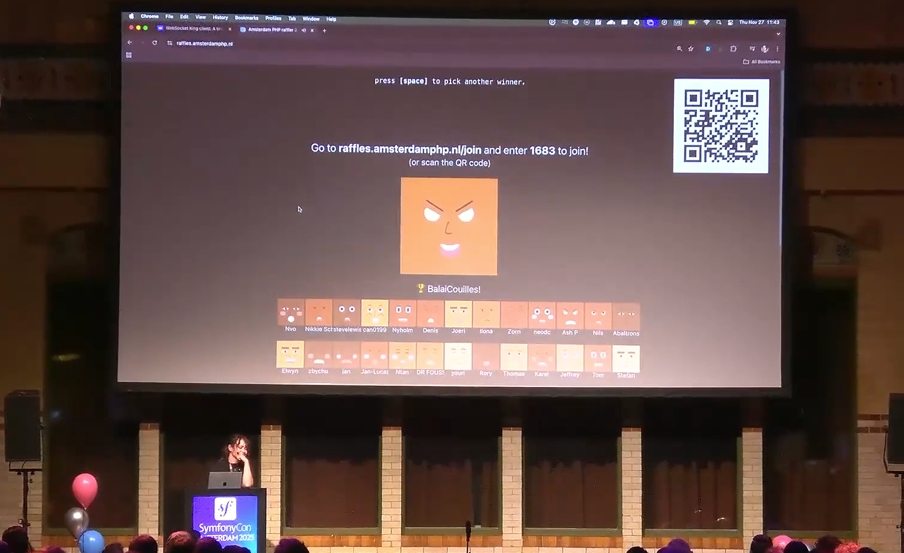

# Let's Build A Raffler With WebSockets!

> **Talk Abstract**
>
> In this talk, I'll tell you how I built the raffler for our AmsterdamPHP meetups using WebSockets. We'll cover several real-time protocols and their limits and advantages.
>
> Then, we'll move on to a whole lot of async PHP implementation using Ratchet for WebSockets. If you've ever wanted to learn how to build something for multiple users communicating in real time, this simple and fun use case is for you.

Speaker: Pauline Vos
* [Slides](https://www.canva.com/design/DAFJx_6OETo/YJFQf1RgMj4AB2ulkJsAOQ/edit)

## Recap

Pauline Vos - Senior Software Engineer at MongoDB, AmsterdamPHP organiser, and known across the PHP community for her Git talks - opens with a disarming admission: the dramatic conference intro music makes it sound like something badass is coming, but really, we're just going to build a raffler.
That raffler is a real thing she built for the AmsterdamPHP meetup a couple of years ago, and she describes it, with affection, as "not super stable, but fun to talk about".
The talk is deliberately scoped: an introduction to WebSockets, a short survey of real-time communication protocols, and a stripped-down implementation - no deep security best practices, no exhaustive error handling, just enough to understand how it works and why it's interesting.

### Functionality and requirements

The raffler has a simple flow, as illustrated in the functionality slide.

The requirements make the engineering challenge clear.

There are two screens: a presenter screen on a laptop and player screens on phones.
Players join with a code, the presenter screen updates as players arrive, and everyone is notified immediately when a winner is picked.
The key constraint is the last one: **all in real time**.

Two naive approaches fall short immediately.
Page refresh is obviously not real-time - players would have to manually reload to see if they won.
Polling - making a request to the server every few seconds - is closer, but still not genuinely real-time, and it generates a constant stream of unnecessary requests.

### The real-time communication landscape

Before committing to WebSockets, Pauline surveys a few alternatives.

**WebRTC** is a Google protocol designed for streaming media - audio, video, peer-to-peer - which makes it a poor fit for a text-based message-passing use case like a raffler.

**Mercure** is the Symfony-adjacent option, written by Kévin Dunglas.
It models real-time communication as a layer on top of HTTP: you publish updates with a POST request and subscribe by opening a server-sent event stream.
It benefits from HTTP/2 features like multiplexing and caching, and crucially offers automatic reconnection with event replay - if a client drops its connection and reconnects, it can receive all the events it missed and rebuild its state.
Pauline notes she still plans to rewrite the raffler in Mercure one day.

**Live Components**, shipped with Symfony and inspired by Laravel's LiveWire, takes yet another approach: Ajax requests trigger server-side rendering of components, and the resulting HTML is used to mutate the DOM.
A fair number of hands went up in the audience when she asked who uses it.

All three are valid tools for the right problem.
For the raffler, she chose WebSockets - and the rest of the talk explains why and how.

### WebSockets: full duplex tunnels

The core mental model for WebSockets is a conversation.

A WebSocket is a persistent tunnel opened between a client and a server.
What makes it particularly suited to this use case is that it is **full duplex**: both sides can send messages simultaneously, without waiting for the other to finish.
This is different from half duplex (two-way but not simultaneous) and simplex (one-way only).
For a raffler, the server can push "Alice joined" to the host screen at any moment, without the host having to ask.

However, WebSockets are deliberately bare-bones.
The tunnel is just a tunnel - it opens and that is it.
Everything else has to be handled by the application or a library:

- no authentication
- no message protocol (no prescribed message format)
- no caching
- no session handling
- no automatic reconnection or state reconciliation

This last point is where Mercure shines in comparison.
With WebSockets, if a client drops and reconnects, it has to rebuild its state from scratch.

### Building the server with Ratchet

For the PHP WebSocket server, Pauline uses **Ratchet**, a library offering components for building WebSocket servers.
It includes session handling via Symfony sessions and wraps the low-level protocol details so the application code can focus on message logic.

She notes that Ratchet was very active when she built the raffler two to three years ago, but has since accumulated deprecation warnings.
There is now a community effort to bring it up to date with PHP 8.4 and beyond - a good opportunity for anyone looking for an open-source contribution.

The core of the server is a class implementing Ratchet's `MessageComponentInterface`.

Four methods make up the interface:

- `onMessage(ConnectionInterface $from, $msg)` - a message arrived on a connection; handle it and respond
- `onOpen(ConnectionInterface $conn)` - a new connection was established; attach it to the client store
- `onClose(ConnectionInterface $conn)` - a connection closed; detach it
- `onError(ConnectionInterface $conn, \Throwable $e)` - an error occurred; close the connection

In the basic implementation, `onMessage` delegates to a `MessageHandler` and sends back `"Pong"`.
The `$clients` property is an `SplObjectStorage` that tracks all open connections.

### The entry point

Starting the server takes only a few lines.

![Entry point: $app = new App('localhost', 8080); $app->route('/', new Raffler(new MessageHandler()), ['*']); echo "Starting raffle server at localhost:8080\n"; $app->run();](./004-lets-uild-a-raffler-with-web-sockets/05-entry-point.png)

A Ratchet `App` is instantiated with a host and port, the `Raffler` is registered at the root route, and `$app->run()` starts the event loop.
That is genuinely all it takes to have a running WebSocket server in PHP.

### The message protocol and raffle logic

Because WebSockets impose no message format, Pauline defines her own: every message is a JSON object with a `message` key holding the message type, plus any payload fields needed for that type.
For example, a `raffleStarted` message also carries the join code; a `newPlayer` message carries the player's username.

The `MessageHandler` JSON-decodes incoming messages, reads the `message` key, and dispatches to the appropriate case via a switch statement.
Three message types drive the full raffle lifecycle:

- `registerHost` - starts the raffle pool, sends back `raffleStarted` with the join code
- `registerPlayer` - validates the join code, adds the player, notifies the host with `newPlayer` and the player with a join confirmation
- `pickWinner` - selects a winner at random, sends `"You won"` to the winner and `"Better luck next time"` to everyone else

The `RafflePool` class owns the raffle state: a connection reference to the host, and an array of `Player` objects keyed by hashed username (to prevent duplicates).
A `Player` is a thin decorator around `ConnectionInterface` that makes it easy to call `send()` on a named participant.

### Demo: WebSocket King and a live raffle

For local testing, Pauline recommends **WebSocket King**, a browser-based tool that lets you open multiple named WebSocket connections simultaneously and save reusable payloads.
In the live demo, she opens one connection as the host (`registerHost`), receives back `raffleStarted` with join code `1234`, then opens two player connections (`registerPlayer`), and finally triggers `pickWinner` from the host - illustrating the full conversation in real time across three browser tabs.

The talk closes with a surprise: a real raffle run live from the stage using the actual amsterdamphp.nl raffler.

Audience members joined by scanning the QR code or going to `raffles.amsterdamphp.nl/join` and entering the join code.
Two prizes were on offer: a license key to Pauline's upcoming Git Legit course, and a hamper of MongoDB swag.
The winner of the MongoDB swag was Ilona; the Git Legit license key went to whoever the second draw landed on.

The overarching lesson is practical and encouraging: real-time multi-user communication in PHP does not require a distributed message broker or a complex infrastructure setup.
A WebSocket server, Ratchet, a clear message protocol, and a handful of classes are enough to build something that works, is fun to demo, and serves a real community purpose - even if it occasionally drops connections when phones go to sleep.
