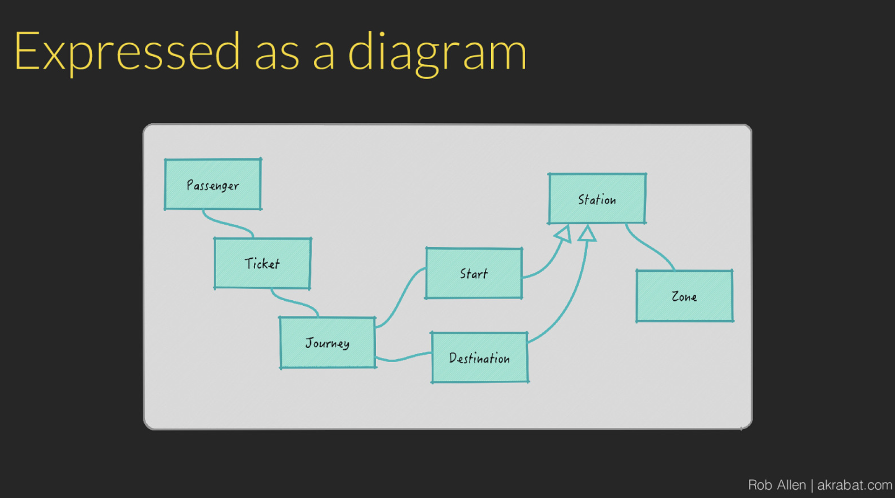
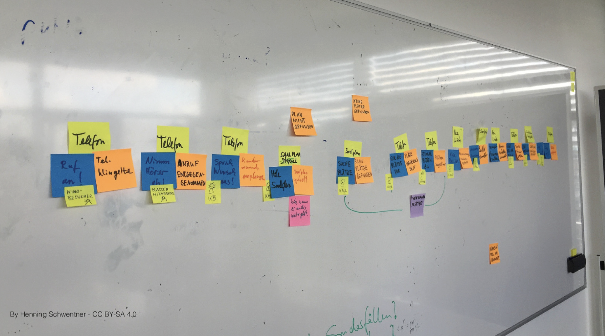
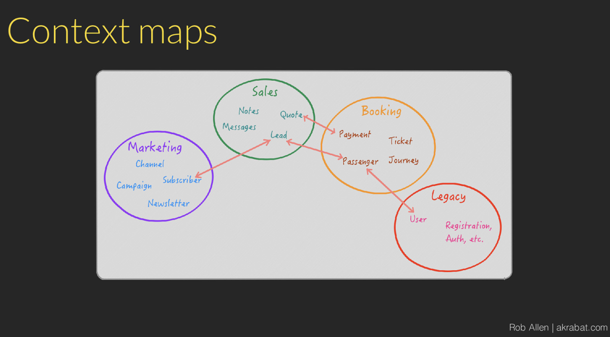

# Strategic DDD

> **Talk Abstract**
>
> Domain Driven Design focuses on modelling the domain logic and helps us to map the business requirements to our software. We'll discuss the terminology and take a look at what Domain Driven Design is and see how you use it to make software that meets the needs of its users. Most people seem to concentrate on the tactical patterns in DDD, but the strategic side is where the most benefit can be found. I will concentrate on the on these strategic considerations, particularly the importance of communication at all levels of the project so that by the end of this session you will be better positioned to create excellent, maintainable applications.

Speaker: Rob Allen
* [Slides](https://akrabat.com/talks/strategic-ddd/)

## Recap

Rob Allen opens with a moment of parental humility: his son was convinced nobody would show up to this talk, certain that everyone would be next door attending Pauline Lafitte's session. The packed room proves him wrong, and he takes a photo to document the fact.

### The book and its two sides

Domain Driven Design by Eric Evans, published in 2003, is one of the rare technical books from that era still worth reading today. It is slightly older than Symfony and not quite as old as PHPUnit. What keeps it relevant is its subtitle: *Tackling Complexity in the Heart of Software*. That problem has not been solved - it is, Rob observes, quite difficult to vibe-code your way to a maintainable piece of software. The maintainable part is the hard part.

DDD addresses complexity through two complementary lenses. The **strategic** side covers the big picture: the direction of the business, how it operates, and how to design software aligned with its problems. The **tactical** side covers the implementation details: design patterns, how to structure code. This talk focuses exclusively on the strategic side, which Rob believes is where the most benefit lies.

### Domains and models

Humans cope with reality's overwhelming detail by building *mental models* - simplified representations of the things we think we know. An optical illusion is simply a case where reality does not match your mental model.

Building software works exactly the same way. The real world is large and complicated; our software does not need all of it. We create models to represent the portion of the problem space we actually care about.

Rob's favourite illustration of a well-crafted model is the London Tube Map, designed by Harry Beck in 1931 to solve a specific problem: passengers could not work out how to change at the right station. Beck's map solves that problem beautifully. It is also, Rob notes, a terrible geographic map - useless for civil engineers trying to measure tunnel lengths or locate actual track. That is fine. A good model solves one particular problem well and makes no pretence of solving anything else.

**The domain** is the subject of the software project: the real-world processes and subject matter the software will address. Rob also calls it the *problem space*. It is understood by domain experts - who are not necessarily the developers. Rob works in fintech and insurance, and is candid that he finds insurance uninteresting and is rubbish at it. The domain experts are the people he leans on to understand the problem.

**The domain model** is the team's shared representation of that domain: a simplification expressed through diagrams, words, and code, but not reducible to any one of those. The model is the *understanding* behind them. It exists to communicate core domain knowledge from the experts to the rest of the project team.

In early modelling work, Rob starts with simple sketches: words written down, boxes drawn around them, lines connecting them. Broad concepts emerge and begin to relate - Passenger, Ticket, Journey, Start, Destination, Station, Zone.

### Ubiquitous Language

Extracting domain knowledge requires talking to domain experts - and language is treacherous. Rob invokes Oscar Wilde's observation that the English and Americans have everything in common nowadays except language. Two parties can use the same word and mean subtly different things. In software, that undetected mismatch becomes an expensive defect.

**Ubiquitous Language** is DDD's answer: a common vocabulary, agreed upon and understood by everyone on the project. When any team member - developer, business analyst, QA engineer, support engineer - uses a domain term, every other person on the team should know exactly what it means.

Rob treats this as the single most important idea in the entire book - the part worth reading if you read nothing else. The failure mode is familiar: you hear a term, assume you know what it means, code against that assumption, and never verify that your understanding matches what the domain expert intended.

The language must permeate the entire software lifecycle: conversations with business people, specifications, code, test cases, QA reports, support tickets. Everywhere. Rob belabours this point intentionally.

Establishing this common language requires genuine communication - which leads to a gentle rebuttal of the developer stereotype. Many developers enter the field believing they are introverts who will never need to talk to another human. Rob considers this nonsense. The best communicators he knows are excellent software developers, because code is itself a form of communication, and the drive to write the best code produces a drive to understand the problem deeply. Learning to communicate well, he argues, is the single highest-leverage career investment available to a developer.

The cost of misunderstanding is real and grows over time. Catching and correcting a misunderstanding at design time is cheap. Finding it in QA and reworking backwards is very expensive.

### Knowledge Crunching and Event Storming

The DDD term for extracting domain knowledge from business people and encoding it in the model is *Knowledge Crunching* - a phrase Rob openly dislikes but accepts as established terminology.

The most widespread technique for this activity is **Event Storming**, which has been around since 2012. Rob finds it useful because it is interactive and simple, and simple tools work well when working with business stakeholders.

The mechanics are deliberately low-tech: post-it notes on a wall. Rob prefers in-person sessions - there is a serendipitous confluence of ideas that happens when people share a physical space that does not replicate as well on a Zoom call.

The session surfaces the *events* in the process - things that happen - and places them on orange cards. Around each event, participants identify:

- **Commands** (blue): what caused the event
- **Actors** (yellow): who caused it
- **Read models and business processes**: what is displayed as a result, and which processes are involved

Anyone in the room can contribute. The system is explicitly democratic: anyone can say "what about that thing?", write it on a card, and stick it on the board. It is a reliable mechanism for surfacing the implicit knowledge that experts carry in their heads without having articulated it.

Once the events are established, **User Story Mapping** translates them into structured requirements. User activities run horizontally across the top; user stories for each activity run vertically downward. Horizontal lines mark user-measurable outcomes - the boundary of the MVP, of phase two, and so on. Rob's practical guidance: only worry about now and next. By the time phase three is relevant, the world will have changed anyway.

The output of this work eventually lands in a task-tracking tool - probably Jira.

### Bounded Contexts

Software grows. Rob has never seen software get smaller over time. New features open new markets; new markets bring new complexity; and that complexity, left unmanaged, erodes the integrity of the domain model. Terms blur; class responsibilities expand; the model dilutes.

DDD's structural response is the **Bounded Context**: the deliberate decision to maintain multiple domain models - one per major section of the application - each covering only the concepts and language relevant to that section.

This is practically useful. In a sales context, a prospective buyer might be a *lead*. After purchase, the same person becomes a *customer*. In a single unified model, the tension between these two representations causes confusion. In two separate bounded contexts, `Lead` and `Customer` are distinct classes with distinct responsibilities. Each model stays coherent.

Without bounded contexts, entropy wins. The technical literature has a name for the outcome: the **Big Ball of Mud**. It appears in an academic paper, Rob observes, which apparently makes it an official technical term.

Bounded contexts can be implemented in many ways: a monolith with internal module boundaries, explicit modules, or microservices. The pattern is agnostic to implementation choice.

### Context Maps

**Context Map** is DDD's term for documenting the full picture: the set of bounded contexts in the application and the relationships between them. Rob acknowledges the term straightforwardly: "we say Context Map because it sounds more professional. That's the only reason we do it."

A context map for a transport booking system might show a Marketing context (Channels, Campaigns, Subscribers, Newsletters), a Sales context (Notes, Messages, Quotes, Leads), a Booking context (Payments, Tickets, Passengers, Journeys), and a Legacy context (Users, Registration, Auth). The relationships between contexts - which concepts are shared, which flow from one to another - are visible at a glance. For developers inheriting an existing application rather than building a greenfield one, the context map becomes a discovery and documentation tool rather than a design artefact.

### Conclusion

Rob closes with a quote from Nick Tune: "Domain-Driven Design is about creating shared understanding of the problem space. It's reinforced ubiquitously by conversations, code, and diagram."

The throughline of the talk is collaboration. Business people understand their problems far better than developers do. Working closely with them - exploring their processes, surfacing their implicit knowledge, building a shared language, and constraining the resulting models within clear boundaries - produces software that is more effective, more maintainable, and more genuinely aligned with what users need.
