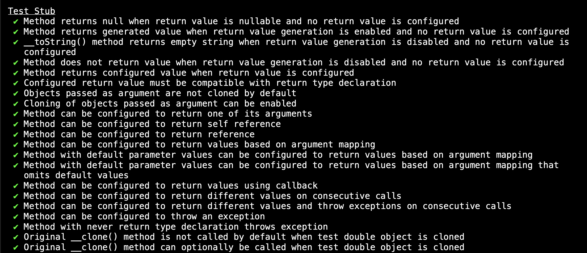
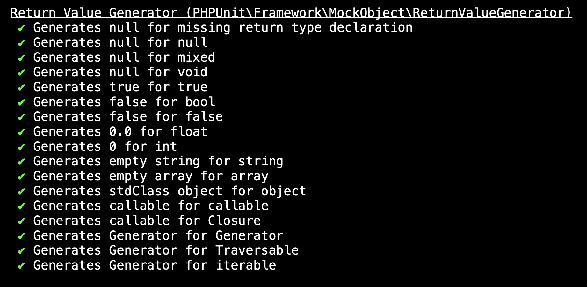
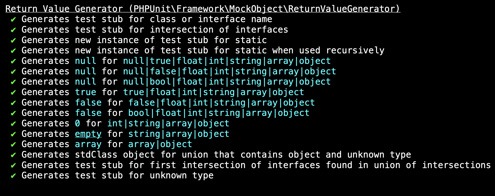

# Testing with(out) dependencies

> **Talk Abstract**
>
> Testing a unit of code that depends on other components often raises a critical question: when should you replace real dependencies with Test Stubs or Mock Objects, and when should you allow the code under test to collaborate with actual dependencies?
>
> This session will demystify the effective use of stubs and mocks in unit testing. You'll gain a clear understanding of how to leverage PHPUnit's test double functionality to write robust tests, while also learning which features to avoid for better maintainability and reliability. By the end of this session, you'll be equipped with practical strategies to make informed decisions about dependency handling in your tests.

Speaker: Sebastian Bergmann
* [Slides](https://phpunit.expert/presentations/testing-without-dependencies.html?ref=symfony)
* [Blog post](https://phpunit.expert/articles/testing-with-and-without-dependencies.html)
* [Video](https://www.youtube.com/watch?v=d3qXBEBNjHc)

## Recap

Sebastian Bergmann opens with a confession: this topic matters to him personally because it helps him think better about tests, and he believes writing better tests is one of the most valuable skills a developer can cultivate.
Before reaching test doubles, he wants to ground the conversation in first principles.

### Objects send messages to each other

In a typical Symfony application, the system is a **web of collaborating objects**. We build behaviour by creating objects, wiring them together, and letting them interact. The emergent behaviour of the system comes from that composition.

Sebastian traces this idea back to Alan Kay, the person who coined the term "object-oriented programming". The metaphor of that era was a living organism composed of cells that communicate using electrical and chemical signals. In object-oriented software, we broke the system down into smaller units that collaborate by **sending each other messages**. Sebastian finds that metaphor clarifying and returns to it throughout the talk.

Not all objects are equal, though. There are two broad families.

**Services** encapsulate a computational process, whether domain logic (price calculations, fraud detection) or infrastructure concerns (persisting to a database, calling an external API). Ideally, a service implements an interface, which makes it easy to swap one implementation for another: a different algorithm, a different provider, or a test replacement.

**Business objects** come in two flavours. **Value objects** represent a value from the domain (an email address, a monetary amount, a measurement) and should be immutable and `final`. **Entities** represent domain concepts that have an identity and evolve over time: a customer accumulates a history, a contract changes state. Both are sometimes called *newable objects*, because it is perfectly fine to instantiate them inline wherever they are needed.

### Test Doubles: the five types

When writing a test, we sometimes cannot (or choose not to) use a real dependency. Infrastructure is expensive to set up, tedious to tear down, and irrelevant to the logic we actually want to verify. The pattern for dealing with this situation is called a **test double**, a term coined by Gerard Meszaros in his book *xUnit Test Patterns*, which surveyed many test frameworks across many languages and gave common names to the concepts it found.

The term, like so much in software, was borrowed from another industry. In film, dangerous scenes are filmed with someone who looks like the famous actor. Harrison Ford is expensive to injure; the stunt double is cheaper. We apply the same economy in tests: we do not want to spin up a full database just to verify a calculation algorithm.

There are five types of test double:

- **Dummy object**: has the right type and passes the type check, but its methods should never be called. Sebastian admits this one never made sense to him and skips it.
- **Stub**: looks like the real collaborator, satisfies the type check, and can be configured to return hard-coded values. "While this test is running, every time this method is called, return this value."
- **Spy**: a stub that records the calls it receives. After the test, you can interview the spy: "Were you called with this argument?" Sebastian uses spies rarely and covers them only briefly.
- **Mock object**: a stub that records calls *and* lets you declare expectations **before** execution. "This method must be called exactly once with this argument, and if it is not, the test fails." This is the mechanism for verifying communication between objects.
- **Fake object**: a real, hand-written (or AI-generated) implementation of an interface that is specific to the needs of your test suite but reusable across tests. A `UserRepository` backed by an in-memory array is the canonical example: it behaves like the real thing, just without touching a database.

Stubs and mocks can be built by hand using PHP's anonymous classes: that is how the pattern originated, in languages that had anonymous classes long before PHP did. You implement the interface inline, hard-code the return values or record the calls, and inject the result as a constructor argument.

### PHPUnit's API

PHPUnit can generate test doubles dynamically, so you do not need to write the anonymous class yourself.

`createStub(InterfaceName::class)` returns an object that satisfies the type requirement. You configure its behaviour using a fluent API:

```php
$sourcer = $this->createStub(SourcerInterface::class);
$sourcer->method('source')->willReturn($market);

$processor = new SellGoodCommandProcessor($sourcer, $emitter);
$processor->process($command);
```

`createMock(InterfaceName::class)` works almost identically but gives you back a mock object, which also exposes the API for configuring expectations:

```php
$emitter = $this->createMock(EmitterInterface::class);
$emitter->expects($this->once())
        ->method('emit')
        ->with($expectedEvent);
```

PHPUnit verifies mock expectations automatically at the end of the test. If `emit` is not called exactly once, the test fails, with a message Sebastian acknowledges could be easier to read, and that he is actively working on improving.

**Configuring return values**

`willReturn($value)` makes every call to the method return the same value. Pass multiple arguments to `willReturn()` and the first call returns the first value, the second call returns the second value, and any further call throws an error: configuring only two values but making three calls is unambiguous evidence that something unexpected happened.

`willThrowException(new \RuntimeException(...))` makes the method throw, which is useful for testing how the system under test handles error paths in its dependencies.

**Configuring call count expectations**

| Method | Meaning |
|---|---|
| `once()` | exactly one call |
| `never()` | zero calls; fails if the method is invoked |
| `atLeastOnce()` | one or more calls |
| `atMost($n)` | zero to $n calls |
| `exactly($n)` | precisely $n calls |

**Configuring argument matchers**

`with()` accepts plain values (PHPUnit wraps them in an equality constraint automatically) or explicit constraint objects from PHPUnit's assertion library. `identicalTo($value)` is the strict equivalent of `assertSame`, checking for reference equality rather than value equality.

### A hot tip: read PHPUnit's own test suite

If you want to know every supported use case, including the ones Sebastian deliberately does not cover in the talk, there are two canonical sources. The first is the PHPUnit documentation. The second, and more instructive, is **running PHPUnit's own test suite with `--testdox` output**.

```
./phpunit --group test-doubles/test-stub --testdox --no-progress
```


The output reads like a spec sheet. Every capability is a passing test with a human-readable name. What can a stub do?



And what does the return value generator produce when you call a stub method without configuring a return value?



The return value generator is an internal mechanism that has existed since PHP 7 added return type declarations. Before that, an unconfigured stub method simply returned `null`. Now PHPUnit computes the minimum viable value for the declared return type: `false` for `bool`, `0` for `int`, `''` for `string`, and so on. For union and intersection types, things get complicated:



Sebastian's advice: do not rely on the generator. Always configure your return values explicitly. It is easier for the reader, and easier for PHPUnit. There is even a configuration option to turn any unconfigured stub call into an explicit error.

### A fun fact: the big test rewrite

This testdox output only exists because last year Sebastian did something that made people question his sanity: he **deleted hundreds of tests** for the stub and mock functionality in PHPUnit. He had grown frustrated with tests that were twenty years old and in a state he could no longer maintain with confidence. Code coverage did not help. He could not tell what was well-tested and what was not. So he wiped the slate clean and rewrote everything from scratch over a couple of weeks.

In doing so he discovered a feature he had completely forgotten about: the ability to register a mock expectation that is only verified if a different expectation was met first. Sebastian has no use case for this and does not remember adding it. The git history was no help, as the transition from CVS to Subversion had lost some of that trail. If you know why this feature exists, he would like to hear from you. Otherwise, he plans to deprecate and eventually remove it. Every line of code is a liability, and a feature nobody can explain is a liability with no corresponding asset.

### When to use what

The conclusion Sebastian wants you to take away is about decision-making, not API details.

**Services implement interfaces and can be doubled.**

- Use a **real implementation** to test that implementation itself.
- Use a **stub** when testing a component that *depends* on the interface: configure the stub to return the values needed to exercise the path you care about.
- Use a **mock** when the correctness of your code depends on the *communication* between two objects: when you need to verify that a method was called, with what arguments, and how many times. Only then.

There is a named anti-pattern here: **over-mocking**. Using a mock where a stub would suffice tightly couples your test to the implementation. The moment the internals change (perhaps a method is called twice instead of once, or in a different order), your test breaks even if the behaviour is correct. Reach for mocks deliberately.

**Business objects (value objects and entities) should never be doubled.** Value objects are immutable and `final` by design, which means PHPUnit cannot extend them to create a double. But that is not a problem: you would not double an integer or a string, and a value object is nothing more than an object that encapsulates a value. Just construct one with the values your test needs. If those values come from a repository, stub the repository to return the object you want.

### A note on `withConsecutive`

`withConsecutive()`, a method that allowed configuring different argument matchers for successive calls to a mocked method, was deprecated and removed from PHPUnit some time ago. It was broken and did not behave the way most people expected. PHPUnit 13, due in two weeks at the time of this talk, ships with a new, working solution for this class of problem.
