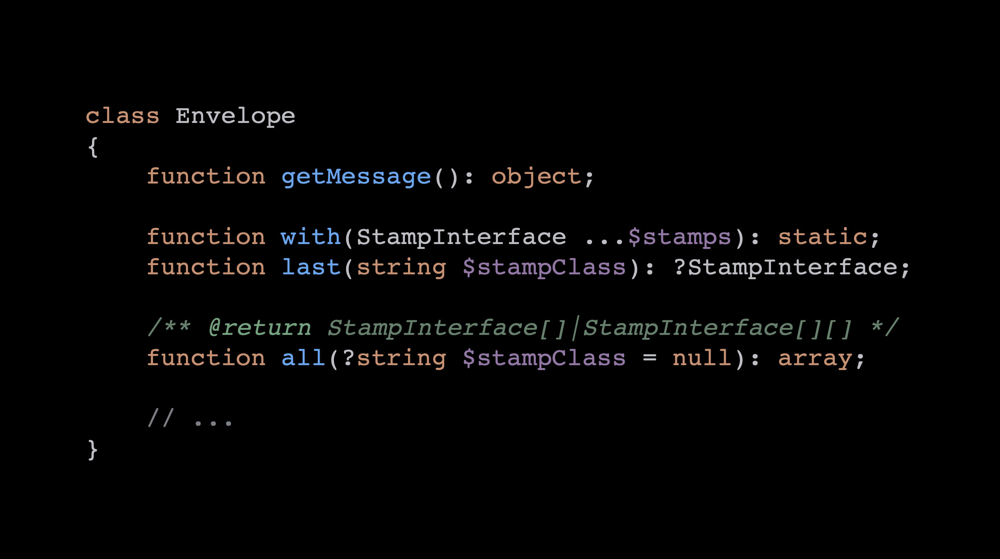
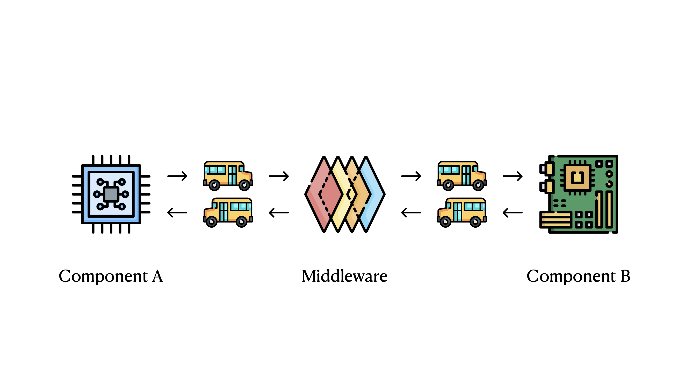
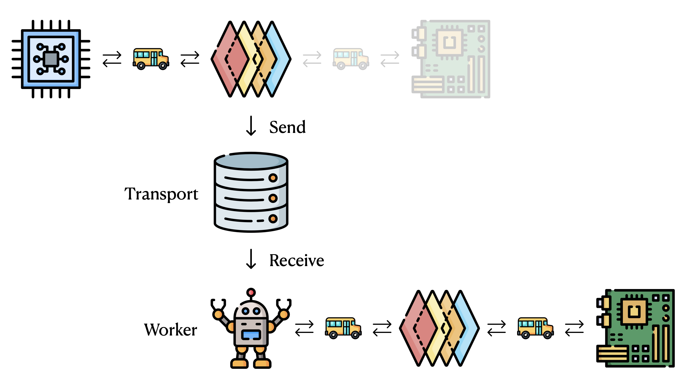

# Unleash the Power of Symfony Messenger

> **Talk Abstract**
>
> This talk will go into detail about how Vacatia leverages the Symfony Messenger component to power our tech stack's critical integration layer. We will look at how and why we use multiple message buses, tracing across multiple messages, chaining interdependent messages together, message batching, and more.
>
> If you want to take your understanding of the messenger component to the next level, this talk is for you!

Speaker: Kris Wallsmith
* [Slides](https://github.com/SymfonyCon/2025-talks/blob/main/slides/Symfony%20Messenger%20Amsterdam.pdf)

## Recap

Kris Wallsmith opens with some context: he has not spoken at SymfonyCon in ten years, and this talk was first given in Chicago on St. Patrick's Day, hence the clovers on the title slide.
He takes a moment to pay tribute to Ryan Weaver, who spoke at that Chicago event despite everything he was going through, and whose positivity and exuberance left a mark on everyone present.

The goal of the talk is to break Symfony Messenger down into its constituent pieces, understand each one clearly, and then look at the advanced patterns Kris's team has built on top of it at Vacatia.

### The Vacatia context

Vacatia manages timeshare resorts. Each resort is its own entity with its own history, which makes software particularly interesting.
Rather than using a single off-the-shelf platform, the team assembled best-of-breed solutions for each problem: a Property Management System (PMS) for reservations, Salesforce for owner contacts and contracts, and a third-party billing provider.

Data flows in from all directions. An owner checks in at a resort and the front-desk clerk updates their address in the PMS. A support agent takes a call and updates the same owner in Salesforce. The owner logs into a portal backed by Salesforce and makes a change themselves.
All three systems need to stay in sync. That synchronisation layer is where Symfony Messenger comes in.

### Symfony Messenger 101

The bus is the entry point. You inject it into a service or controller, dispatch an envelope (or a plain message), and get the envelope back.

An **Envelope** wraps a message and carries **stamps**. The `Envelope` class exposes `getMessage()` to read the message, `with()` to add stamps (returning a new immutable instance), `last()` to read the most recent stamp of a given class, and `all()` to retrieve every stamp of a given class as an array.

A **Stamp** is a marker interface. It carries no behaviour; it just signals to the bus and to other middleware that a particular piece of metadata is present on the envelope.

**Middleware** is the main extension point. The envelope travels from Component A through a stack of middleware layers to reach Component B, and then the returned envelope travels back through the same stack.

Each middleware implements a single `handle(Envelope $envelope, StackInterface $stack): Envelope` method. The stack gives access to the next middleware. A middleware can do work before calling the next layer, catch exceptions thrown by it, react to its success, or run cleanup in a `finally` block. Two middleware ship with Symfony core: `SendMessageMiddleware`, which routes envelopes to a **transport**, and `HandleMessageMiddleware`, which delivers the message to its **handler** (Component B).

A **transport** (RabbitMQ, SQS, Doctrine, and others) externalises the message from the current process. A **worker** then receives the message from the transport and passes it back through the same bus middleware stack, eventually reaching the handler.

One important consequence: any middleware that modifies an envelope will run twice for asynchronous messages, once when the message is dispatched and once when the worker picks it up. Middleware must account for this.

### Porter: Vacatia's integration layer

At Vacatia, this integration layer is called **Porter**. It connects the PMS, Salesforce, and the billing provider. Porter runs two separate bus configurations: an **event bus**, which does not require any handler to be registered (zero or many handlers are both acceptable), and a **job bus**, which enforces that every dispatched job is handled exactly once.

### Tracing messages with ID stamps

With many messages flying around the system, the first thing Kris built was a way to identify each one. He created an `IdStamp` backed by Symfony's UID component, specifically a ULID, and an `IdMiddleware` that applies it.

The middleware checks whether the envelope already carries an `IdStamp` before adding one. This guard is essential precisely because of the double-pass described above: when the worker replays the message through the middleware stack, the stamp is already present and should not be duplicated.

### Logging with stateful context

With message IDs in place, the next step is making those IDs appear in every log entry produced while handling a given message.

A stateful `IdContext` object is injected into the middleware. Before calling the next layer, the middleware pushes the current message ID onto the context. After the next layer returns (in a `finally` block), it pops the ID back off.
Everything that runs inside the next middleware, including the handler, has access to the current ID through the context.

A Monolog processor reads from that context and appends the `message_id` field to every log record. The result is that any log line produced during message handling can be correlated back to the specific message that triggered it.

The same middleware can also persist a row to a database table each time a message is dispatched, updated once it carries a `HandledStamp` (added by the framework after successful handling), and updated again with error details if an exception is thrown.

### Nested messages and ancestry tracking

Handlers frequently dispatch further messages. A Salesforce event arrives, the event bus fans it out, and several adapters each dispatch a job to update a downstream system. A single incoming event can produce a whole tree of descendant messages.

To capture this ancestry, the `IdMiddleware` is extended. When a new message is being stamped for the first time, the middleware reads all the IDs currently in the `IdContext` (the IDs of every message currently being handled up the call stack) and writes them onto the envelope as a sequence of `IdStamp` instances, one per ancestor. It then appends a final `IdStamp` for the new message itself.

Because `Envelope::all()` returns all stamps of a given class in order, the full lineage is preserved on the envelope. It can be stored as a path column in a database table, which makes it straightforward to reconstruct the message tree and visualise everything that flowed from a single originating event.

### Message chaining: sequencing and dependencies

The reservation flow at Vacatia requires multiple sequential API calls to the PMS: create the reservation, then update it, then attach guest information. Each step depends on the previous one completing successfully, and the update step needs the reservation ID that the creation step returns.

Kris calls this **message chaining**, and he breaks it into two distinct concepts.

**Message sequencing** is handled by a `ChainStamp` that wraps the next envelope to dispatch. After the current message is handled successfully, a `ChainMiddleware` reads all `ChainStamp` instances from the envelope and dispatches the embedded envelopes in order. If the message was sent to a transport rather than handled directly, the chaining is skipped: it will happen when the worker eventually processes the message.

**Message dependencies** handle the case where the next message needs data produced by the current handler. Symfony places the return value of a handler into a `HandledStamp` on the envelope. A `ChainInterface` with a single `chain(object $previousMessage, mixed $result): ?object` method lets a message class opt in to receiving that result. The `ChainMiddleware` checks whether the embedded message implements `ChainInterface`, calls `chain()` with the previous message and the handler's return value, and dispatches the resulting object (or skips dispatching entirely if `chain()` returns null).

In practice, an `UpdateReservation` message can be constructed with all the update details it already knows, and implement `chain()` to receive the `Reservation` object returned by `CreateReservation`'s handler. It extracts the reservation ID from it and stores it internally. When the handler for `UpdateReservation` runs, the ID is already there.
