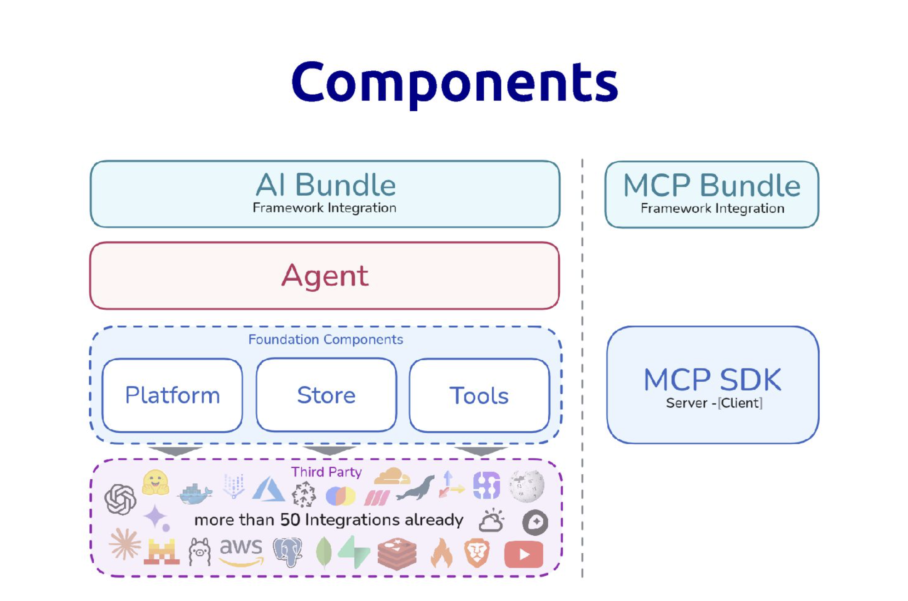
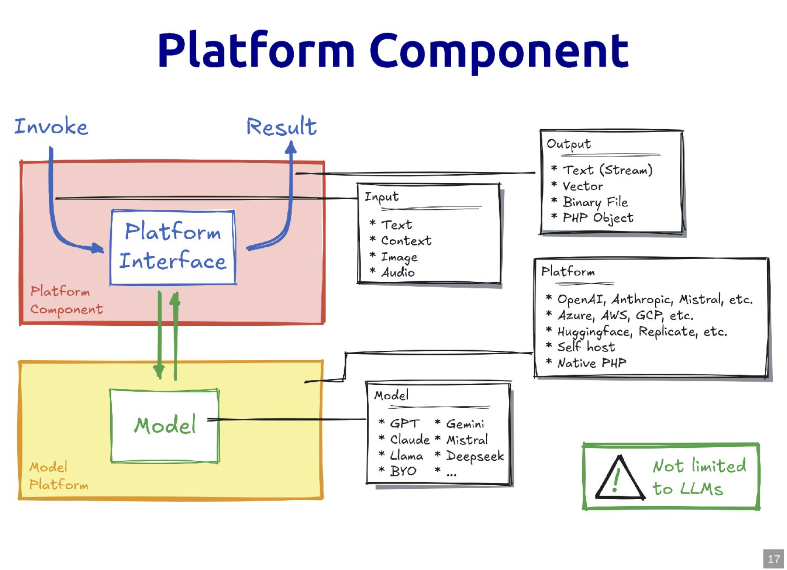
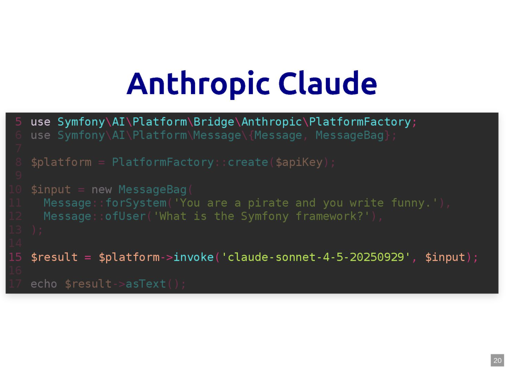
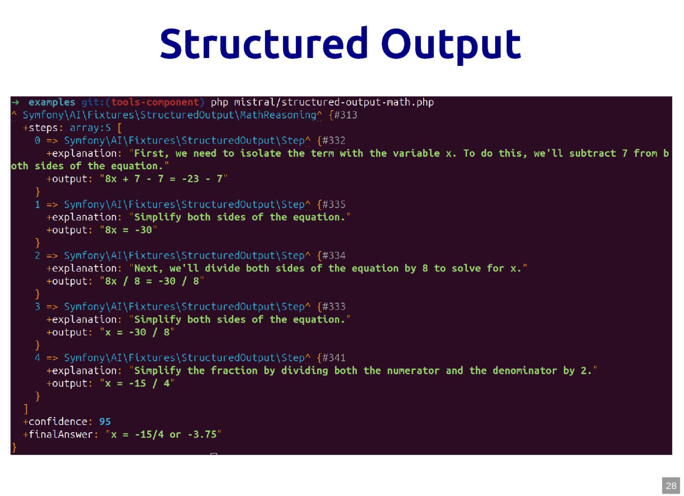
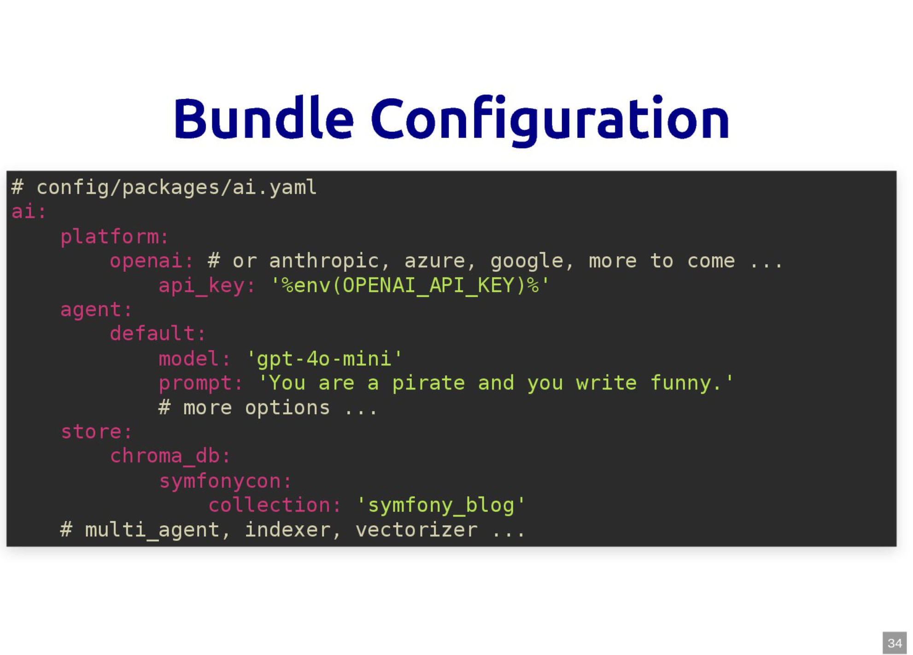
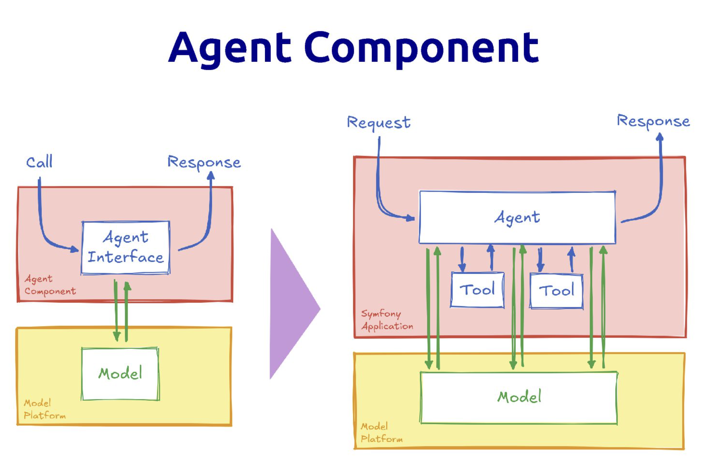
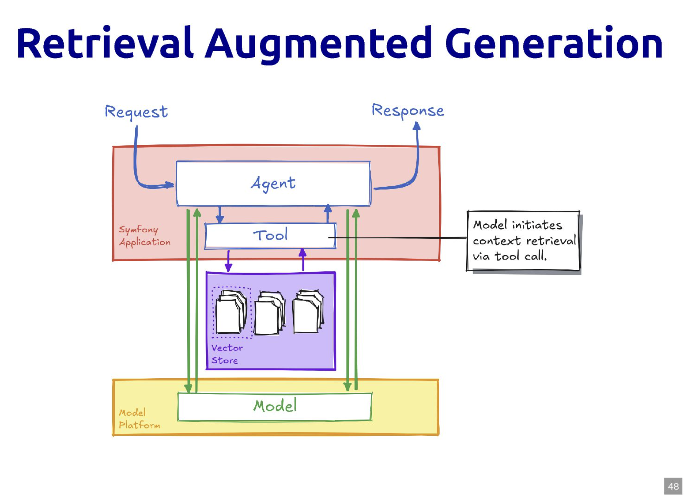
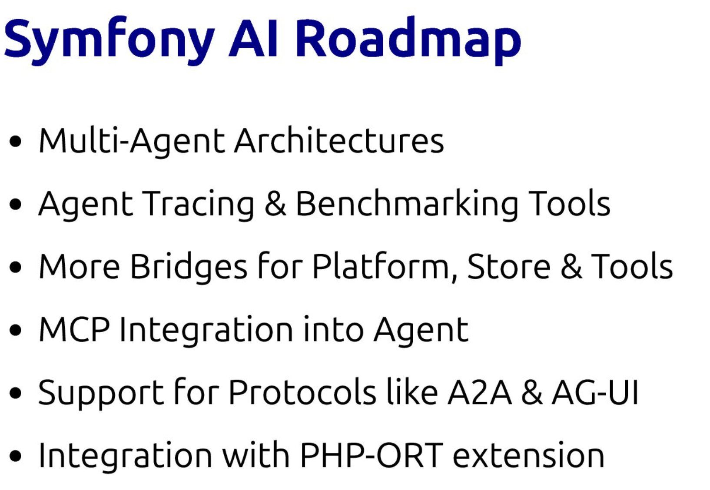

# Symfony AI in Action

> **Talk Abstract**
>
> At first AI is a ton of buzzwords and hype, but how do we integrate AI in our existing products / software projects in a meaningful and realistic manner?
> Let's have a look how Symfony AI enables us to bring AI-based or even agentic features, not only chatbots, into our PHP applications or scaled architecture.
> If you are looking for input on how to approach AI, need ideas where to get started or find out what's realistic at first - let this talk be your inspiration!

Speaker: Christopher Hertel
* [Slides](https://speakerdeck.com/el_stoffel/symfony-ai-in-action)
* [Video](https://www.youtube.com/watch?v=WiEqxGRg5K4)

## Recap

Christopher Hertel opens by acknowledging the room: yes, many of us are a bit tired of AI.
The relentless hype about five-year transformations and job displacement can wait.
This talk skips all of that and goes straight to what you can actually build today with **Symfony AI** - real features, hands-on, no hypotheticals.

### The Symfony AI initiative

The initiative was announced publicly in July 2025 after roughly two years of preparation.
A deliberate decision was made to keep it out of the `symfony/symfony` monorepo: it lives in its own `symfony/ai` repository, similar to how Symfony UX operates with a separate release cadence.

The repository has not had a single tag yet - interfaces were still being broken as the talk was delivered - but a first `0.x` release was imminent.
The versioning will be independent of Symfony's time-based schedule, though it will respect the same backward-compatibility promises once stable.
At the time of the talk: around 73 contributors, roughly 2,000 commits, and - because of the sheer number of vendor integrations - close to 71 packages.
That last number might actually shrink over time: some of those vendor startups may not exist in a year.

The stated goals are to enable AI-native features inside a Symfony application without delegating to Python or TypeScript, to support far more than just LLMs, and to remain vendor-agnostic so that switching between OpenAI, Anthropic, Google Gemini, or a self-hosted model does not require rewriting application code.

### Component architecture

The architecture is deliberately layered.



At the bottom sit more than 50 third-party integrations.
On top of them, three **foundation components** handle the heavy lifting: Platform (model inference), Store (vector stores), and Tools (integrations with Wikipedia, YouTube, and other external services).
The **Agent** component sits above those and is where things get genuinely interesting.
The **AI Bundle** provides the optional Symfony framework integration on top of everything else.
A separate MCP Bundle and MCP SDK are also in the works.

The component architecture is deliberate: you can use Platform or Agent stand-alone without the full Symfony framework kernel.
Symfony components like the Serializer are used internally, but the full stack is not mandatory.

### The Platform component

The Platform component is the vendor-agnostic abstraction for invoking models.



It is multi-modal: inputs can be text, images, audio files, or PDF documents.
Outputs can be plain text, a stream, a vector (for embeddings), a binary file, or a PHP object.
The "not limited to LLMs" warning on the diagram is intentional - embedding models, image models, and audio models are all valid targets.

The API surface is intentionally simple: construct a `MessageBag` with messages in different roles (system, user), invoke the Platform with a model name, and call `->asText()`.
Switching from OpenAI to Anthropic Claude means changing the `PlatformFactory` import and the model name string; everything else stays identical.



The same pattern holds for Gemini, Mistral, Llama, and the other 25 platform bridges currently available.
Streaming is supported - just iterate over the result instead of calling `->asText()`.
There is also an event system for hooking into calls at the infrastructure level.

### Structured output

One of Christopher's favourite features is **structured output**: instead of receiving a text blob, you pass a PHP class to the Platform and receive back a populated instance of that class.



This is powered by JSON Schema under the hood, and the serializer integration means you can add enums, min/max constraints, and other annotations to the class to guide the model's output.
For data extraction from unstructured text, this turns a text generation call into something that feels much closer to a regular service call: you define the shape you want, and you get it back.

### The AI Bundle

For Symfony full-stack projects, the AI Bundle (`composer require ai`) provides YAML configuration that maps directly onto the component concepts.



The vendor key under `platform` determines which bridge is loaded; the `agent` block sets the default model and system prompt; `store` wires up a vector store.
Everything else - injecting the Platform or Agent as a service, auto-wiring tools - follows the standard Symfony DI conventions.

### The Agent component

The Platform handles a single request-response cycle.
The **Agent** component is built for multi-step interactions: it combines a platform, a model, a context (system prompt and conversation history), memory, and a set of **tools** that the model can call.



Tool calling is the mechanism that makes agents genuinely useful.
The model does not execute PHP code directly - it signals that it wants to call a tool, the Agent component intercepts that signal, invokes the corresponding Symfony service, and sends the result back to the model.
From the model's perspective, it is a conversation; from the application's perspective, it is a ping-pong of API calls and service invocations.

Marking a method as a tool requires a single PHP attribute:

```php
class Clock
{
    public function __construct(private ClockInterface $clock) {}

    #[AsTool]
    public function now(): string
    {
        return $this->clock->now()->format('Y-m-d H:i:s');
    }
}
```

The live demo illustrated the point precisely: a bare LLM asked "what time is it?" will hallucinate a confident but wrong answer.
An agent with the `Clock` tool above calls the service, gets the real time, and returns it.
The entire Symfony infrastructure - Doctrine, the security component, any existing service - is available as a tool.
You *could* expose your entire Doctrine repository as a tool. You shouldn't. But you could.

### Multi-agent architectures

The Agent component also supports **agent-as-a-tool**: one agent can call another agent as if it were a regular tool.
This keeps context windows focused - a lightweight front-runner model handles simple conversational exchanges and delegates to a heavier specialist agent only when needed.

**Handoffs** take this further: an orchestrator agent routes incoming requests to specialised sub-agents based on topic detection.
A request mentioning "bug", "error", or "debug" gets routed to a debugging agent; a question about billing goes elsewhere.
The orchestrator decides; the sub-agents execute.

### Retrieval Augmented Generation

For knowledge retrieval, the **Store** component abstracts over vector databases (Pinecone, MongoDB, Redis, ChromaDB, and others).



The **Indexer** handles the pipeline: load a source (for example the Symfony blog RSS feed), split it into documents, generate embeddings in parallel, and store them in the vector store.
A built-in `SimilaritySearch` tool then makes any configured vector store queryable by the agent without additional code.

The live demo showed exactly this: the vector store was re-indexed with the Symfony blog (a new major release had just shipped the day before), and the agent answered questions about the latest release correctly by retrieving the relevant documents at query time.
The Symfony Profiler showed the full agent workflow: which system prompt was used, which tools were configured, which tools were actually called, and what each tool returned to the model.

### Live demos

Three further demos illustrated the breadth of what is already possible.

**Structured output with recipes**: the Platform is called with a `Recipe` PHP class as the target type.
GPT populates it - title, ingredients, steps, difficulty, prep time, dietary classification - and the result is rendered directly in a Twig template.
The model can generate content for form fields; the application treats it like any other data object.

**YouTube Q&A**: a YouTube bridge fetches a video transcript.
The transcript becomes the context for a conversational agent.
The streaming response is pushed to the browser via Turbo Streams and server-sent events, providing a responsive chat interface without a JavaScript framework.

**Voice assistant with multi-agent delegation**: speech-to-text converts a spoken question into text, a fast front-runner model handles simple exchanges, and a heavier RAG-capable sub-agent is called in when the question requires knowledge retrieval.
Text-to-speech converts the final answer back to audio.
The multi-agent handoff is transparent to the user.

### Roadmap

The short-term focus is on stabilising existing interfaces and shipping the first tagged release.
Feature depth will follow adoption and community feedback.



Longer-term goals include deeper multi-agent architectures (Fabien's workflow component was mentioned as a natural fit), agent tracing and evaluation tooling, and MCP client integration so that a Symfony agent can use tools exposed by Python or TypeScript MCP servers.
AG-UI (generative UI) is on the radar - returning rendered UI elements rather than structured data - though Christopher acknowledged it is more exploratory.

The most technically ambitious item is integration with **PHP-ORT**, a PHP extension under active development by Joe Watkins and backed by the PHP Foundation.
ORT brings ONNX-compatible model inference into PHP via a C extension with GPU support.
The goal: run smaller models natively inside PHP without any HTTP call to an external API.
That would close the loop between the Symfony AI components and the models themselves - all in PHP.

Christopher closes by inviting the community to bring real-world use cases rather than more bridge requests, and points to the `symfony/ai-demo` repository as the best place to start experimenting.
