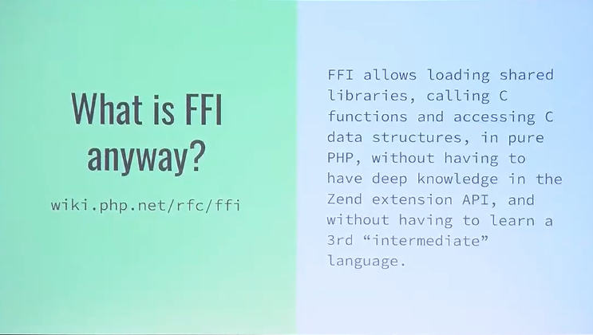
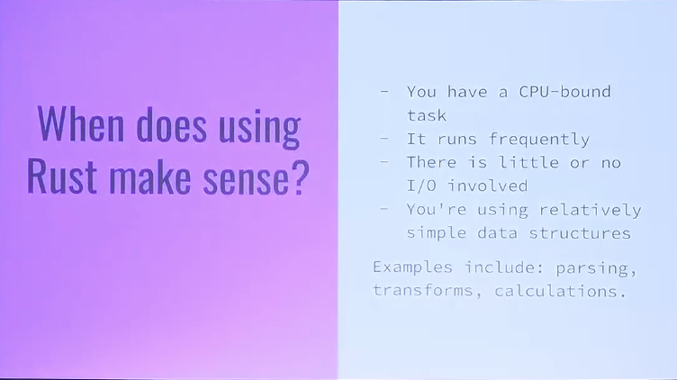
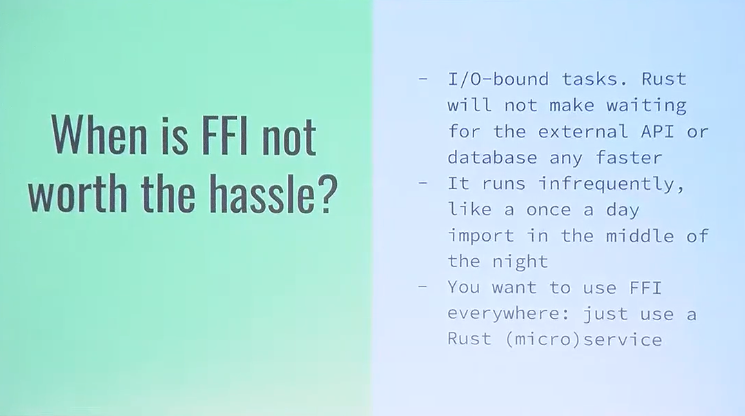
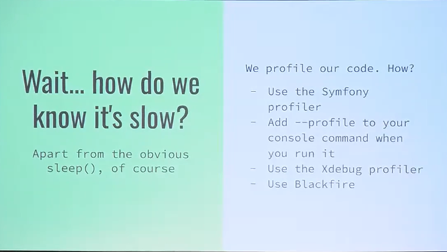

# Symfony and Rust: Accelerating Hot Paths with FFI

> **Talk Abstract**
> 
> I'm not going to tell you to rebuild your application in Rust. At all.
> I love Symfony (and PHP), we all do. But there are times when we hit a performance roadblock.
> Or run out of memory. Maybe even both.
> 
> In this talk, we’ll replace part of our logic with a native helper using PHP’s FFI and Rust.
> We’ll explore performance gains, show practical implementation steps, and discuss when native code makes sense.
> And finally, I’ll share a skeleton project so you can start experimenting in tonight.

[Slides](https://docs.google.com/presentation/d/11MGhIGZyv_UT5lnhPTaguGyO4y9Dn6mDJWGr3OVytl0/edit?slide=id.p#slide=id.p)
[Code Example](https://github.com/MitchelAnthony/herding-cats-bundle)

Speaker: Mitchel Vroege
* [Github profile](https://github.com/MitchelAnthony)

## Recap

Mitchel Vroege's talk makes a clear case for _augmenting_ Symfony applications with Rust rather than rewriting them.
The central message is pragmatic: PHP and Symfony are great, but when specific parts of an application hit CPU or memory limits,
PHP's Foreign Function Interface (FFI) allows developers to selectively offload those "hot paths" to native code (often Rust)
while keeping the rest of the system unchanged.

### FFI

The talk begins by positioning FFI as a low-friction alternative to PHP extensions.
Introduced in PHP 7.4, FFI allows PHP code to load shared libraries, call C-compatible functions,
and work with native data structures directly.
Rust fits well here because it can compile to a C ABI while offering strong safety guarantees and efficient memory management.

### Rust, but when?

A key theme is _when_ Rust actually makes sense.
Vroege stresses that not every performance issue warrants native code.
Rust via FFI is most effective for CPU-bound workloads such as heavy calculations, large JSON parsing,
or logic that runs frequently with little or no I/O.

Conversely, I/O-bound tasks (database access, network calls) see no benefit,
and infrequent jobs may not justify the added complexity or maintenance cost.

### Profiling first

Before reaching for Rust, developers should first identify real bottlenecks using profiling tools.
The talk demonstrates how Symfony’s built-in profiler, Xdebug, Blackfire,
and CLI profiling can pinpoint slow paths and memory usage.
Only once a genuine hotspot is confirmed should FFI be considered.

### Rust-to-C

On the implementation side, the talk walks through a practical example:
exposing Rust functions with `extern "C"` and `#[no_mangle]`, compiling them into a shared library,
and defining matching C signatures in PHP using `FFI::cdef()`.

While the Rust-to-C binding layer can feel a bit awkward,
especially around strings and structs,
the setup is manageable and can be cleanly hidden behind a Symfony service or bundle.

### Nuanced performance

Performance results are encouraging but nuanced.
In the demo, replacing a PHP implementation with Rust dramatically reduced execution time
and even cut peak memory usage by more than half.
However, benchmarking also showed that FFI has a small overhead, reinforcing the idea that it’s a precision tool:
you need a real performance win to offset the cost of crossing the PHP, native boundary.

### Conclusion

The talk concludes with a balanced takeaway: Rust isn’t scary, FFI is powerful,
and the gains can be substantial, but only when used deliberately.
Symfony remains the core platform, Rust is an accelerator for specific problem areas,
and a shared repository provides a ready-to-use skeleton for experimentation.
