# CQRS in Symfony: yes, but calm down

> **Talk Abstract**
>
> CQRS is often associated with complex, over-engineered systems. But in real-life Symfony apps, it can be a pragmatic tool to structure features, simplify code and separate concerns - when used right.
>
> In this talk, you'll see:
> - when and where CQRS brings real value in Symfony projects
> - how to structure commands, handlers, queries and DTOs in a maintainable way
> - practical integration with Symfony Messenger and validation
> - what to avoid: CQRS anti-patterns that create friction, not clarity

Speaker: Oskar Barcz
* [Slides](https://docs.google.com/presentation/d/13GVdUHDshBCCNDID6xQgTydyqEthnCIu5eFHII2GBFY/edit)

## Recap

Oskar Barcz opens with a provocation: CQRS is everywhere - DDD practitioners use it, junior developers encounter it as soon as they see a Handler class - yet it is constantly associated with over-engineering and complexity.
The talk's goal is to show that CQRS, at its core, is a simple and pragmatic idea you can adopt without going anywhere near event sourcing, aggregate roots, or distributed systems.

### The Symfony \*Service hell

The starting point is a pattern almost every Symfony developer has written: a controller that does too much, refactored by extracting a service class.

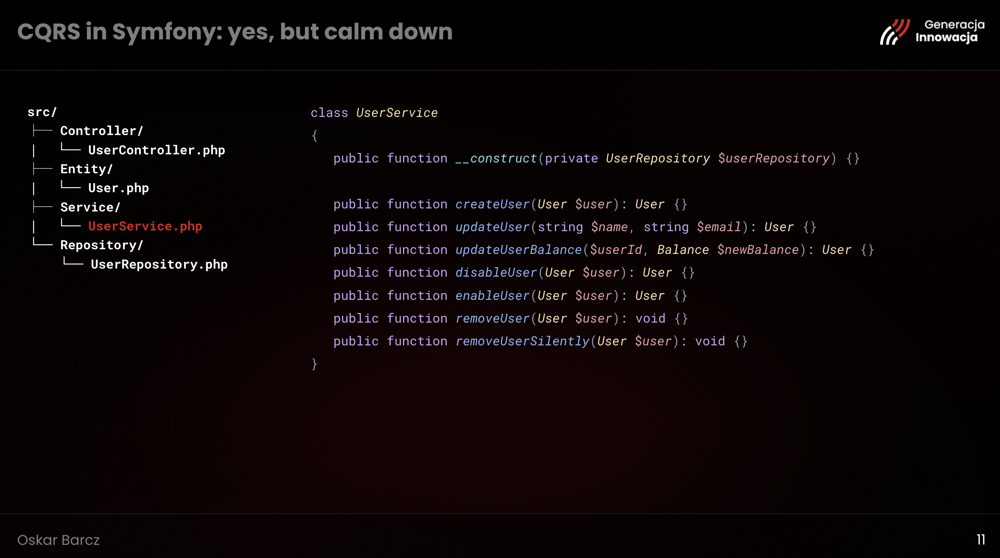

The `UserService` looks reasonable at first: a single class that handles `createUser`, `updateUser`, `updateUserBalance`, `disableUser`, `enableUser`, `removeUser`, `removeUserSilently`.
But Robert Martin's Single Responsibility Principle states that a class should have only one reason to change.
That `UserService` has seven.
Change anything about how users are enabled, or how they are deleted, or how their balance is updated, and you touch the same file.
This is the Symfony `*Service` hell: you moved code out of the controller, but you only shuffled the problem elsewhere.

### What CRUD doesn't capture

CRUD maps cleanly onto REST.
Create is a POST, Read is a GET, Update is a PATCH, Delete is a DELETE.

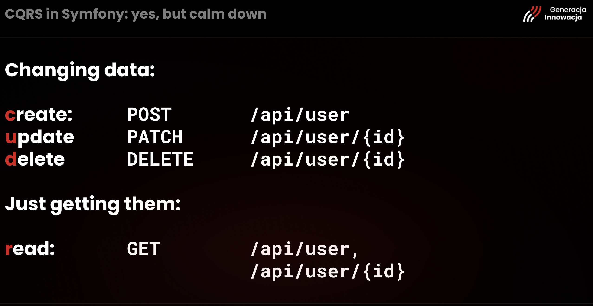

But real applications are not pure CRUD.
"Enable user" is not a `POST /users` or a `PATCH /users/{id}` in any meaningful sense.
"Cancel booking", "Mark invoice as paid", "Generate monthly report" - these are business actions with a clear intention that the REST vocabulary cannot express precisely.

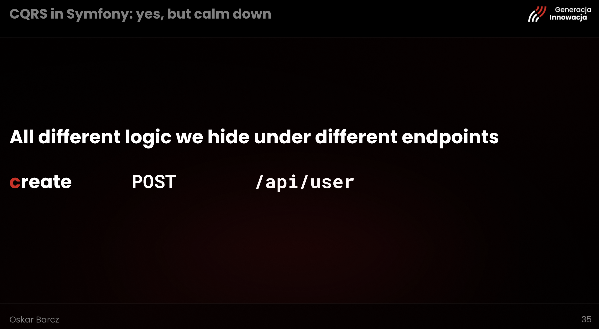

All that different logic ends up hidden under endpoints, with the complexity growing inside services that accumulate methods over time.

### Commands: intention and payload

CQRS - Command Query Responsibility Segregation - proposes a simple split: either you are changing the system, or you are reading from it.
On the write side, each action becomes a **Command**: a small, immutable object that carries two things.

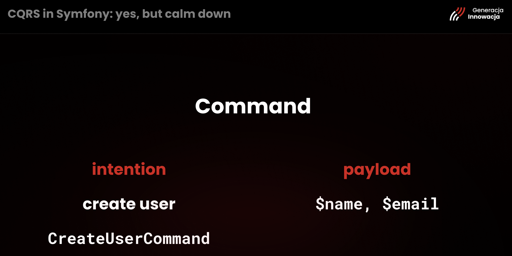

The **intention** is encoded in the class name itself: `CreateUserCommand` tells you exactly what the system is being asked to do.
The **payload** is whatever data is needed to perform that action - for user creation, that is `$name` and `$email` (and an ID, generated upfront by the caller).
Commands are `readonly` classes; they should not change after construction.

Each Command has exactly one **Handler**, a class with a single `__invoke(CreateUserCommand $command): void` method that contains the business logic for that one use case.

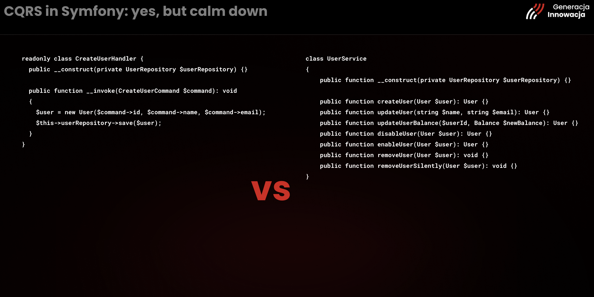

The handler on the left does the same work as the `createUser` method inside `UserService` on the right.
The difference is what surrounds it: the handler has no other methods, no other reasons to exist.
If something changes in user creation, only `CreateUserHandler` changes.

### Easier to test, easier to reason about

The testability improvement is immediate.

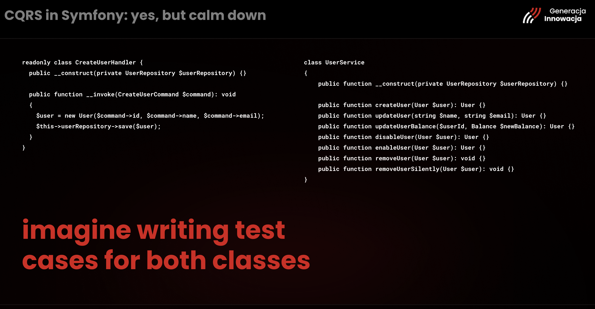

Writing unit tests for a `UserService` with seven methods means writing test cases that span all seven concerns in a single test file, which easily grows to thousands of lines.
Writing unit tests for `CreateUserHandler` means writing test cases for one thing.
Five edge cases in user creation produce a focused, readable test file.
SRP compliance is no longer aspirational - it is structural.

### The file structure and the controller

The recommended folder layout puts Commands and their Handlers side by side under a `Command/` directory, Queries under a `Query/` directory, with the Controller, Entity, and Repository at their usual locations.

The controller shrinks to a pure HTTP layer.
It decodes the request, constructs a Command, dispatches it on the **command bus**, and returns a response.
It no longer knows which class handles the command or what it does internally.

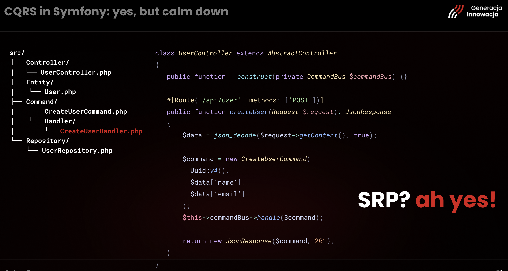

### Queries don't need a bus

For the read side, a separate **Query** class can be a plain service with an `__invoke` method - and because Symfony supports controller method injection, the query object can be injected directly into the action method without going through a bus at all.

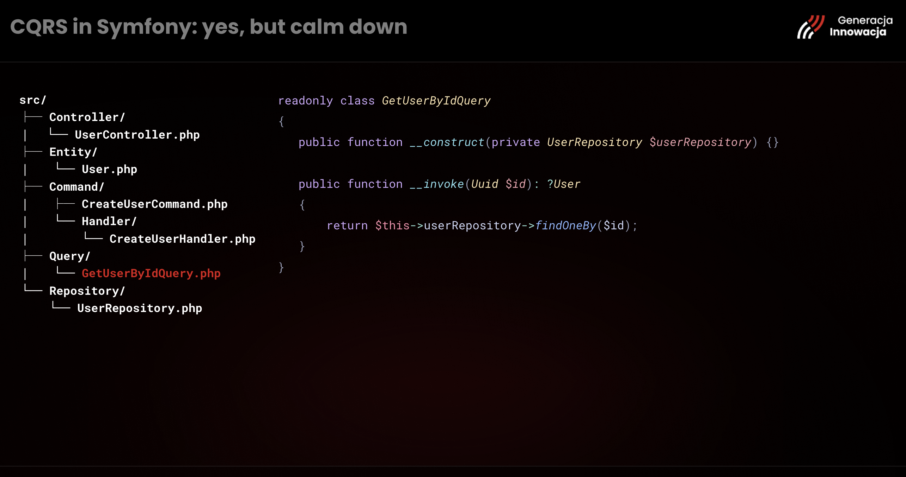

The query class holds the repository dependency and knows how to fetch the data.
The controller method receives it as an injected argument, calls it with the relevant parameters, and returns the result.

A separate Query object - a DTO wrapping filter parameters - is only worth creating when the query has enough parameters to justify it.
For simple lookups, the method parameter itself is sufficient.
The guidance: don't create objects you don't need.

### The flow, and what the bus unlocks

The three diagrams illustrate how the architecture evolves.
First, the straightforward approach: Request → Controller → Repository → Response.
Then the service layer: an extra hop, but the same linear chain.
Then CQRS: the controller hands off to a command bus, which finds the specific handler, which calls the repository.

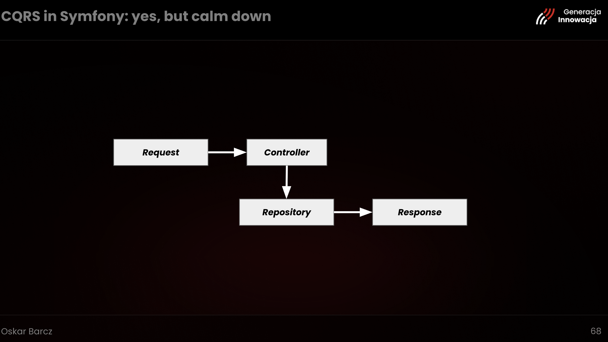

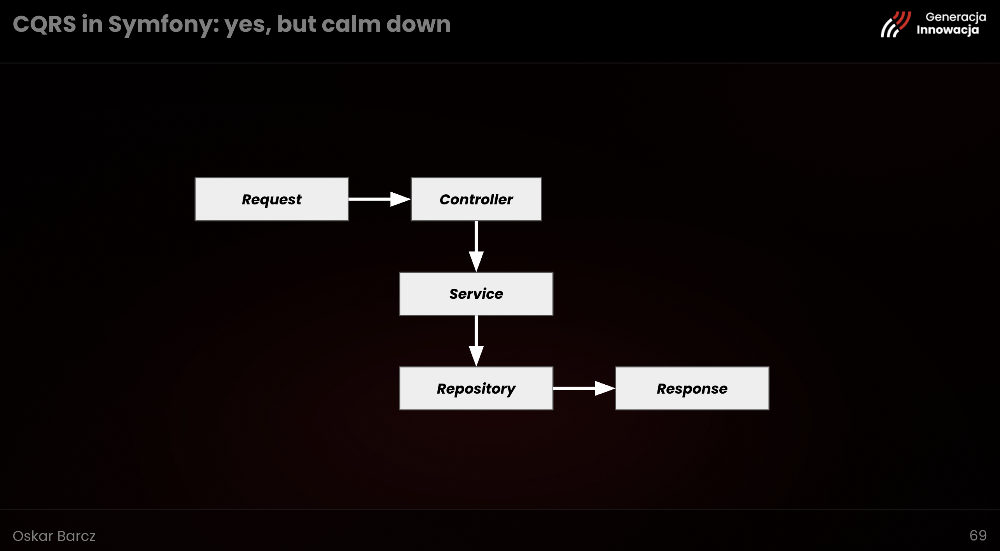

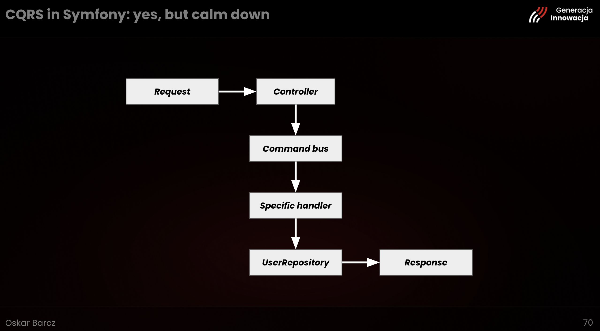

The bus is where CQRS starts to compound.
When commands are dispatched synchronously, the handler runs in the same request and the response waits for it.
But the bus can also dispatch commands **asynchronously**: the HTTP service acknowledges the request immediately, and a separate worker picks up the command and executes the handler out of band.

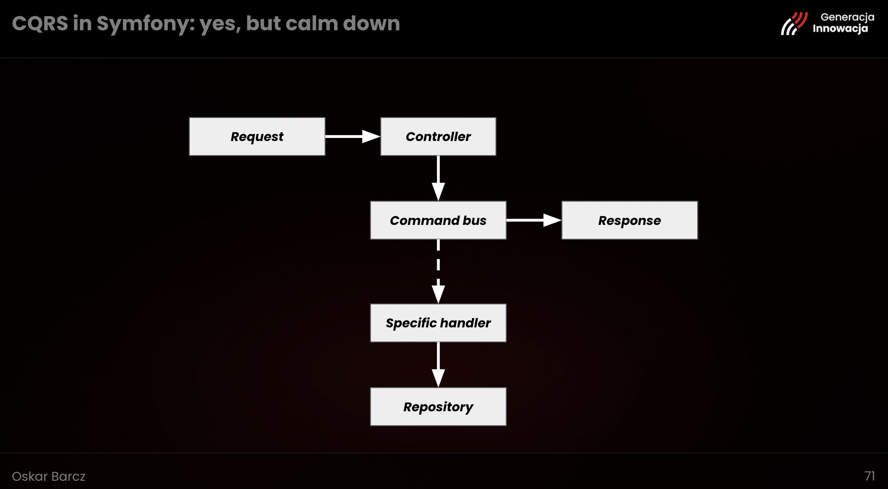

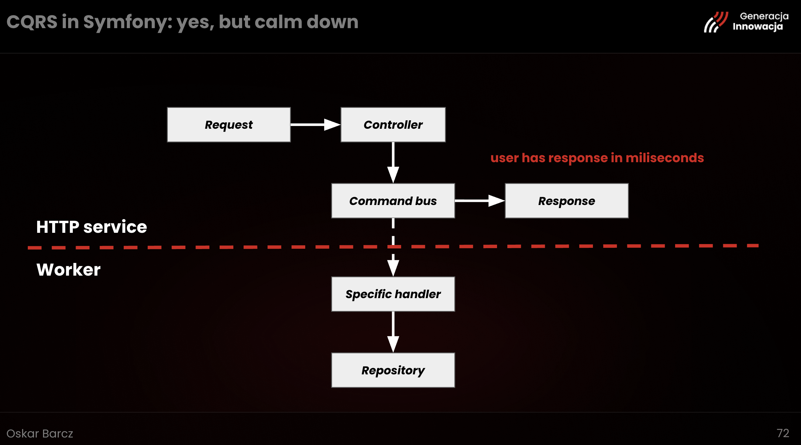

Generating a monthly report over millions of transactions no longer forces the user to wait five minutes for an HTTP response.
The user gets an acknowledgement in milliseconds; the worker does the heavy lifting whenever it can.
Symfony Messenger - which is already powering Symfony Mailer under the hood - provides this infrastructure out of the box, with support for Doctrine, RabbitMQ, Amazon SQS, and more.

### But do you need it?

The iceberg slide is deliberate.

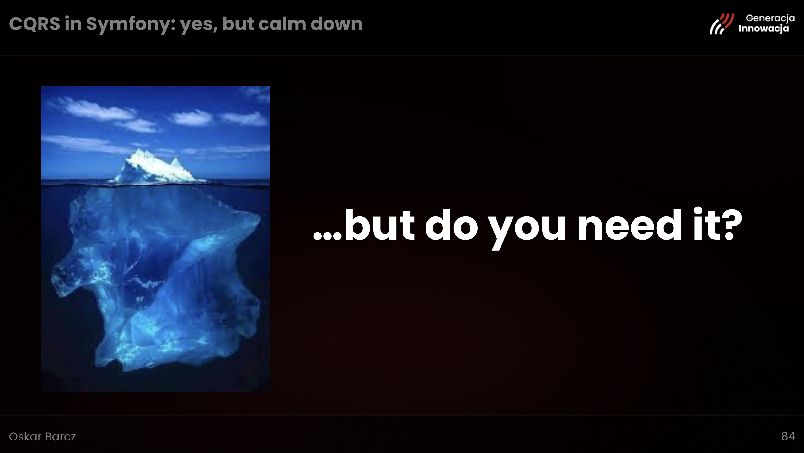

Event sourcing, read models, write models, sagas, distributed workers, independent scaling - these are all real capabilities that CQRS enables.
They are also all optional.
The core of the pattern - one class per intent, a bus to dispatch it, a handler to execute it - is available without any of the advanced machinery.

### What CQRS is

The conclusion slide lists everything the pattern can give you.

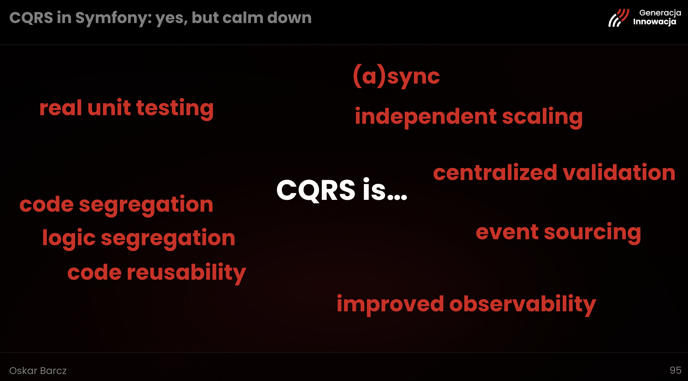

Real unit testing, because handlers are small and focused.
Sync or async execution, because the bus abstracts the transport.
Independent scaling, because workers can scale separately from the HTTP service.
Code and logic segregation, and code reusability between handlers.
Centralized validation through bus middleware.
Improved observability, because every intent is a named, loggable object.
A path to event sourcing, if the application ever needs it.

The overarching message: you don't need to adopt any of these to benefit from the pattern.
CQRS at its simplest is just a discipline - one class, one purpose, one reason to change - and that discipline alone makes code easier to read, test, and maintain.
Pick what you need and leave the rest for when you actually need it.
