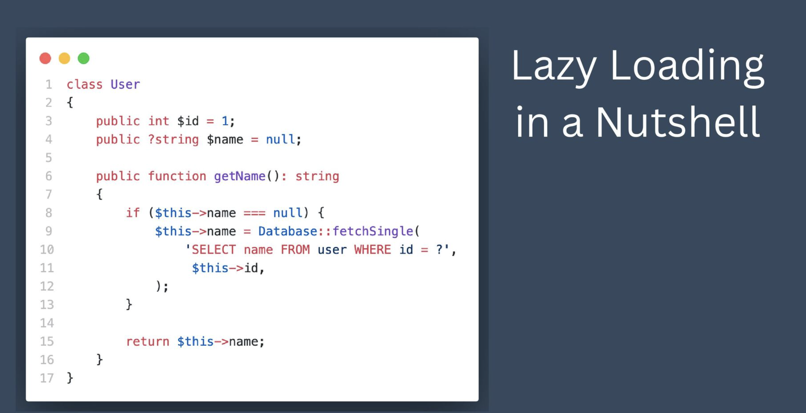
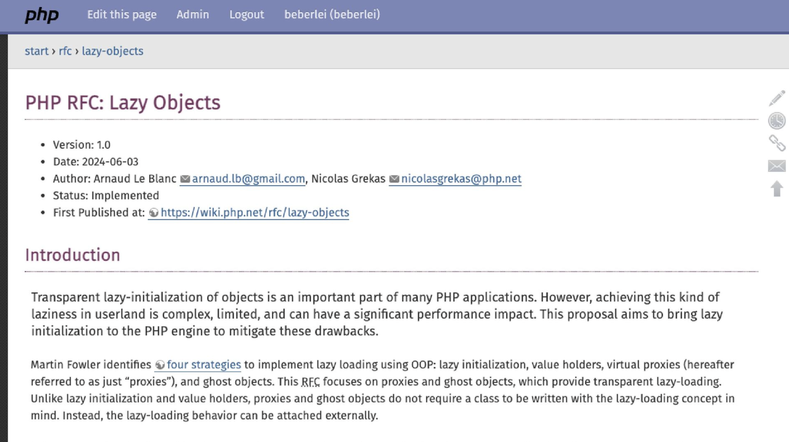
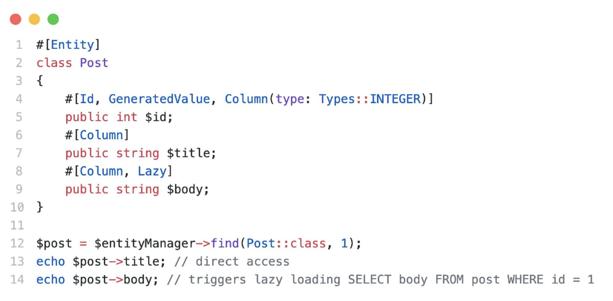
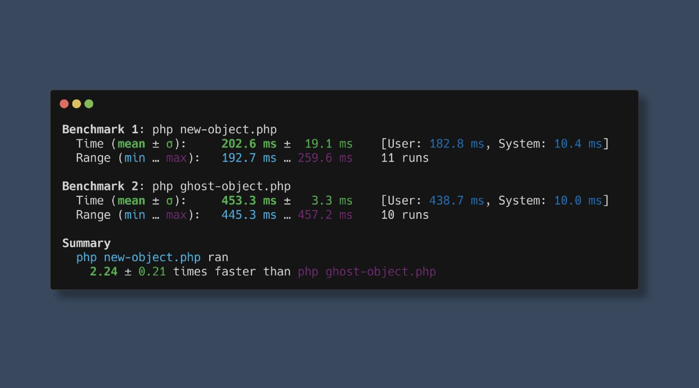

# How native lazy objects will change Doctrine and Symfony forever

> **Talk Abstract**
>
> Starting with PHP 8.4 you can implement lazy loading and proxy objects with native PHP functionality with little overhead and no code generation required. Both Doctrine and Symfony are historically using the proxy pattern with solutions and workarounds built in PHP. In this talk I will explain PHPs 8.4s native lazy objects and how it will be a game changer to both Doctrine and Symfony going forward.

Speaker: Benjamin Eberlei
* [SpeakerDeck slides](https://speakerdeck.com/beberlei/how-native-lazy-objects-will-change-doctrine-and-symfony-forever)
* [YouTube video on the same topic](https://www.youtube.com/watch?v=HflZlZ-5zho)

## Recap

Benjamin Eberlei's talk traces the 15-year journey from Doctrine's hand-written code-generated proxy objects to PHP 8.4's native lazy object support - a feature that makes everything Doctrine and Symfony had to implement in userland unnecessary.
Benjamin is unusually well-placed to tell this story: he is a Doctrine core team member, a PHP Foundation board member, and the founder of Tideways, a performance profiling tool.
All three angles converge on the same feature.

### What is a lazy object?


A lazy object is a reference to an object that does not yet exist in memory.
You can pass it around and hold onto it, but the actual object - with all its data - is not constructed until the first moment something reads from it or writes to it.
This is the lazy loading pattern applied at the object level: defer the work to the last possible point.

The simplest version of lazy loading is a method that checks whether a property is null before loading it from the database:



It is not reusable, but it captures the essence: check, load if missing, return.
You can generalise this with a base class that handles the loading, which is the **Active Record** pattern used by Eloquent, Propel, and Doctrine 1.

### Doctrine's proxy approach: fifteen years of workarounds

Doctrine 2 - released in 2010 - had a different premise: it should not force entities to extend a base class.
A plain PHP object with an `$id` and a `$name` property, mapped with annotations, should just work.
The trick was **code generation**: Doctrine would generate a subclass of your entity at build time,
override every public method to check "am I loaded yet?", and delegate loading to an initialiser closure if not.

This worked, but came with real limitations.
Because the proxy is a subclass, `get_class()` and `::class` return the proxy's name, not the original entity's.
Code that checks the class name breaks silently.
Entities cannot be marked `final` because the proxy must extend them.
And as PHP evolved - adding read-only properties, property hooks - the code generator had to handle each new case,
making it increasingly complex and slow.

Marco Pivetta later introduced a more general Proxy Manager library, and Nicolas Grekas maintained it while also adding proxy support directly into Symfony.
Nicolas found a clever trick for public properties: unset them in the constructor so that PHP's `__get` magic hook fires on access,
which then triggers the initialiser.
But even Nicolas eventually hit a wall: the complexity of handling every PHP feature combination had grown too large to sustain in pure userland code.

### The PHP 8.4 RFC

That frustration led Nicolas to collaborate with Arnaud Le Blanc, a PHP Foundation developer, on an RFC to solve the problem at the language level.



The RFC was accepted and shipped with PHP 8.4.
It introduces two new methods on `ReflectionClass`: `newLazyGhost()` and `newLazyProxy()`.
Both accept an initialiser closure and return an uninitialised instance of the class.

**Ghost objects** are the common case for Doctrine.
When initialisation is triggered, the closure receives the ghost instance, calls the constructor on it, and populates its properties.
After initialisation, the ghost is completely indistinguishable from an object that was never lazy.
`get_class()` returns the real class name, `final` works, read-only properties and property hooks work,
same-object comparison (`===`) works, and no code generation is required.

**Proxy objects** are needed to break circular references.
If service A depends on service B and B depends on A, a ghost would recursively trigger full initialisation of both.
A proxy keeps two objects in the engine - the shell and the real one - and forwards all calls from the former to the latter.
The downside is a slight memory overhead and the fact that same-object comparison can break in edge cases depending on which reference you hold.
This is the variant Symfony's DI container uses for circular service dependencies.

### What triggers initialization - and what does not

The engine marks a lazy object as uninitialized and watches for:
- reading or writing any property
- testing a property with `isset()` or `unset()`
- inspecting the object via Reflection
- cloning the object

Crucially, **calling a method does not trigger initialization on its own**.
Only when that method reads or writes a property does initialization fire.
This means you can call methods that operate purely on already-known state without paying the loading cost.

PHP 8.4 also adds `ReflectionProperty::setRawValueWithoutLazyInitialization()`.
This lets you set a specific property on an uninitialized ghost without triggering full initialization,
and marks that property as loaded.
Doctrine uses this to pre-populate the entity's identifier on the ghost object:
accessing `$user->id` will never trigger a database query, but accessing `$user->name` will.

### Doctrine's new implementation

With native lazy objects, the entire body of generated proxy code reduces to a single initializer closure:

```php
$ghost = $reflectionClass->newLazyGhost(function (User $object) use ($id, $persister) {
    $object->__construct();
    $persister->loadById($id, $object);
});
```

The persister executes the query, populates the object, and Doctrine is done.
Everything that was previously generated - thousands of lines of class definitions - disappears.

To opt in, set the `enable_native_objects` flag in your Doctrine configuration.
It works well, and Benjamin's own application has been running it for several weeks without issues.

### What native lazy objects unlock next

Beyond replacing the existing proxy infrastructure, the new capability opens the door to features that were previously too fragile to ship.

**Undeprecating partial DQL queries.**
Doctrine 3 deprecated partial objects - queries that load only some fields of an entity - because the old implementation was bug-prone.
This upset many users who relied on them to avoid loading large blob columns.
With native lazy objects, the unloaded fields can simply be left lazy on the ghost: accessing them triggers a follow-up query, transparently.
You may pay an extra query if you accidentally access a lazy field, but you will never get a corrupt object.
The partial DQL feature is being undeprecated.

**Always-lazy fields.**
The next step, currently being designed, is a `#[Lazy]` attribute on individual entity properties:



Marking `$body` as `#[Lazy]` means every `find()` call returns a partial ghost.
`$post->title` resolves immediately; `$post->body` fires a SELECT.
A separate DQL hint will let you opt into eager loading for specific queries when you know you need the field.
As a side note: this slide also shows that multiple PHP attributes can be comma-separated inside a single `#[...]` declaration - `#[Id, GeneratedValue, Column(type: Types::INTEGER)]` - which is easy to miss but very handy.

### Symfony's dependency injection container

Symfony has always supported marking individual services as `lazy`, but the implementation required code generation,
making it impractical to apply laziness broadly.
The overhead was simply too large to use it by default.

With native lazy objects, that cost drops dramatically.



Creating a ghost is only about **2.2× slower** than a plain `new`.
That sounds significant, but no DI container creates 10 million objects per request.
A typical Symfony application has a few hundred services, each created at most once per request.
At that scale, the 2× overhead is invisible - but the savings from skipping unnecessary construction, autoloading, and database connections for services that were never actually needed can be very real.

A prototype experiment in Magento - where a single request can construct thousands of objects -
showed that making every service lazy with roughly 20 lines of code eliminated **25–30% of request time** just from avoided object construction.
Symfony's container is already more efficient than Magento's, so the gain will be smaller,
but the direction is clear: the community should investigate automatically detecting which services benefit from lazy initialization during the compile step and applying it without developer intervention.
