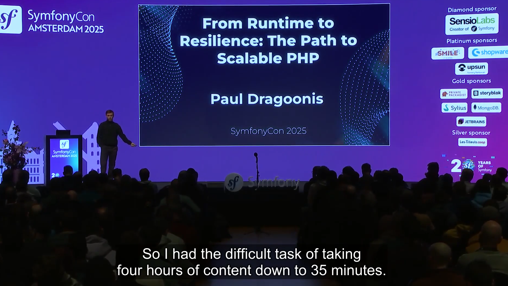
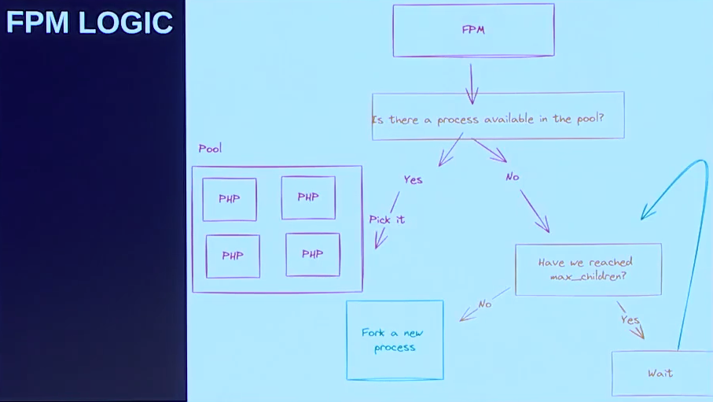
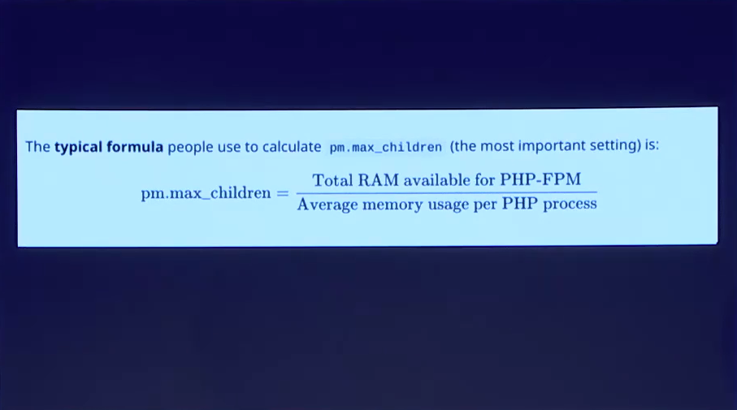
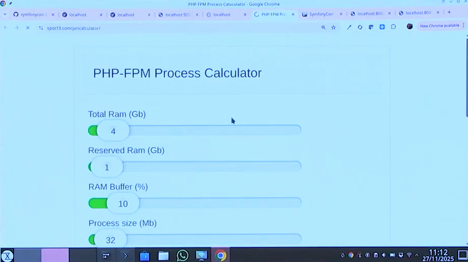
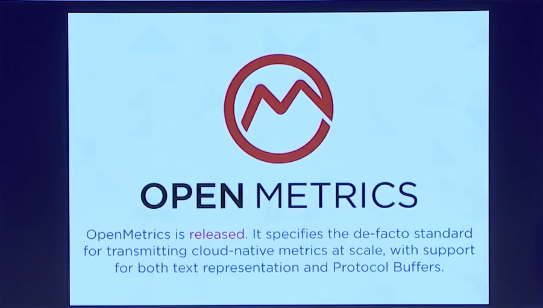
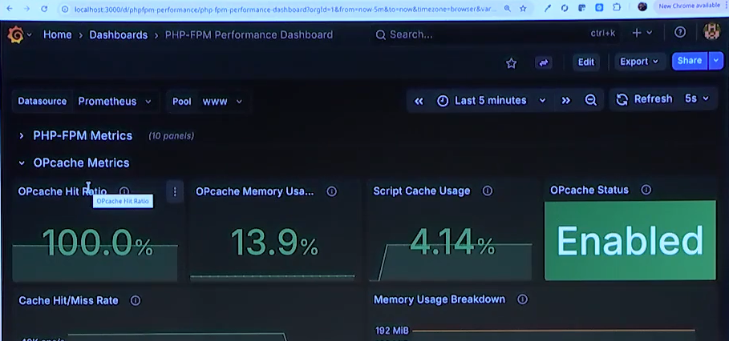
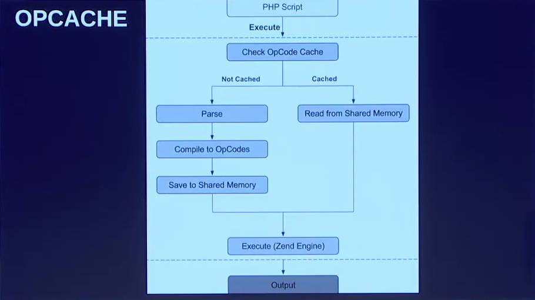
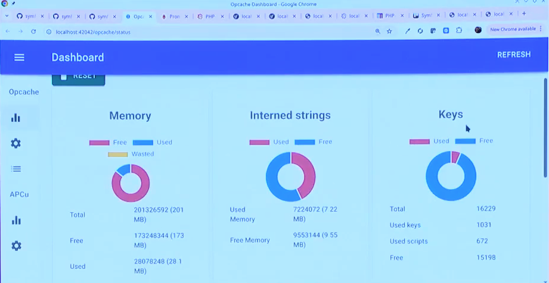
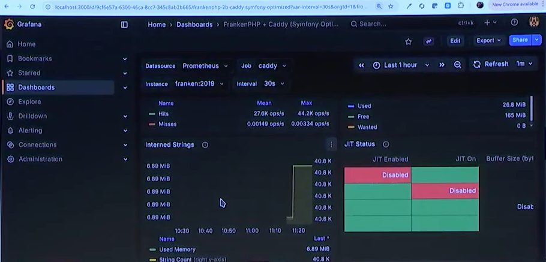
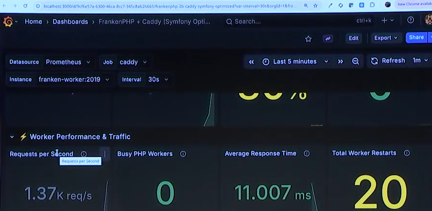

# From Runtime to Resilience: Scaling PHP

> **Talk Abstract**
>
> Scaling PHP is about resilience and performance, not just traffic.
> This talk covers live demos of optimising the PHP runtime, tuning configs,
> and measuring FrankenPHP and PHP-FPM with tools like OpenMetrics, Grafana, and k6.
> Additionally, you'll learn to avoid design flaws, architect for scalability,
> and gain the mindset to confidently scale PHP applications.

Speaker: Paul Dragoonis
* [Code (workshop repo)](https://github.com/dragoonis/symfonycon-2025-scaling)

## Recap

Hold on to your socks. Paul Dragoonis warns the audience upfront:
this talk is a five-hour workshop compressed into thirty minutes.



Everything shown in the talk is available in a public GitHub repository that includes

* a sample Symfony application
* Docker setup
* Makefile targets
* Grafana dashboards
* k6 load tests
* markdown guides

The intention is clear: take it back to your company, run it, improve it, contribute back.

### PHP runtime quick wins

There is no silver bullet for high-performance systems.
It is lots and lots of tiny things that add up.
Paul starts with a handful of `php.ini` settings that most developers never touch.

**`zend.detect_unicode`**: on by default, it checks every file for a Unicode BOM.
You need it roughly 1% of the time. Turn it off.

**`session.auto_start`**: on by default for most setups,
it means every request opens a session, even API calls that have no use for one.
If sessions are stored in Redis,
that is a network round-trip just to discover the session is not needed.
Turn it off globally,
and let the framework enable sessions only for routes that actually require them.

**`realpath_cache_size`**: PHP goes to the filesystem to resolve symlinks
and relative paths, then caches the result. Give it 4 megabytes.
The disk is the slowest part of your machine; RAM is cheap and fast.

**`disable_functions`**: a security hardening setting.
Disable functions like `pcntl_*`
and other process-manipulation calls that your application does not need.

From the workshop's production `php.ini`:

```ini
zend.detect_unicode=0
session.auto_start=Off
realpath_cache_size=4096K
realpath_cache_ttl=600

disable_functions=pcntl_alarm,pcntl_exec,pcntl_fork,pcntl_get_last_error,pcntl_getpriority,pcntl_setpriority,pcntl_signal,pcntl_signal_dispatch,pcntl_sigprocmask,pcntl_sigtimedwait,pcntl_sigwaitinfo,pcntl_wait,pcntl_waitpid,pcntl_wexitstatus,pcntl_wifexited,pcntl_wifsignaled,pcntl_wifstopped,pcntl_wstopsig,pcntl_wtermsig,posix_kill,posix_mkfifo,posix_setpgid,posix_setsid,posix_setuid
```

### Composer autoloading

Most developers know about `composer install -o`,
but they pass it on the command line and sometimes forget.
Paul recommends hardcoding the optimisation in `composer.json` so it is always active:

- **Optimised autoloader**: roughly 15% faster class loading, all the time.
- **APCu autoloader**: an extra cache layer on top of the optimised autoloader, sometimes yielding 50% faster lookups.
- **Classmap authoritative**: forces Composer to rely entirely on the generated classmap.

```json
{
    "config": {
        "optimize-autoloader": true
    }
}
```

### Redis: igbinary and multi-instance reads

By default, PHP's Redis extension serialises data with PHP's native format.
An open-source library called **igbinary** provides a compact binary serialisation format.
Compile PHP with `--enable-redis-igbinary`, turn it on, and every Redis read
and write gets faster with no code changes.

For higher availability without full replication or clustering,
Paul suggests a simple trick: configure a list of Redis instances
and write to all of them. Reads can then hit any instance.
It is not a cluster, but it gives you redundancy cheaply.

### PHP-FPM: tuning and monitoring

FPM spawns processes up to `max_children`, then queues.



The formula for calculating `max_children` is straightforward:

> `max_children = available RAM / average memory per PHP process`



But how do you know what your average process memory is?
Paul demonstrates a set of command-line tools that list all running FPM processes
and their memory consumption, letting you compute the average and spot outliers.

There is also an online **FPM Process Calculator**:
enter your per-process memory size and total available RAM,
and it tells you what your FPM settings should be.



The workshop's FPM pool configuration:

```ini
[www]
listen = 9000
pm.status_path = /fpm-status

pm = dynamic
pm.max_children = 300
pm.start_servers = 5
pm.min_spare_servers = 5
pm.max_spare_servers = 50
pm.max_requests = 1000
```

**FPM status endpoint**: a metrics endpoint built into every FPM installation
that most developers never enable (`pm.status_path = /fpm-status`).
An **FPM exporter** can ping that endpoint and format the data as **OpenMetrics**,
the international standard for metrics export.



Once in OpenMetrics format, the data can be ingested by Prometheus, Grafana,
or any other popular monitoring system.

Paul's workshop repository includes a pre-built Grafana dashboard for FPM,
showing active processes, memory usage, listen queue depth, and more,
all updating in real time as k6 load tests hammer the application.



### OPcache: seeing inside the box



OPcache has three settings that matter most:

- **`opcache.max_accelerated_files`**: the number of PHP files OPcache can hold.
    Set it well above your actual file count,
    because as your project grows with new dependencies,
    you do not want to silently hit the limit and fall off a performance cliff.
    And here is a piece of trivia: the value **must be a prime number**.
    If it is not, PHP will round it to the nearest prime, which is unnecessary computational overhead.
    Set it to a prime number above your target threshold.
- **`opcache.memory_consumption`**: how much shared memory OPcache gets.
    Under-provisioning means files get evicted and recompiled;
    over-provisioning wastes RAM.
- **`opcache.interned_strings_buffer`**: caches interned strings
    (class names, method names, string constants) across all processes.

```ini
opcache.enable=1
opcache.enable_cli=1
opcache.validate_timestamps=0
opcache.revalidate_freq=0
opcache.max_accelerated_files=16087
opcache.memory_consumption=192
opcache.interned_strings_buffer=16
opcache.fast_shutdown=1
opcache.enable_file_override=1
opcache.preload_user=www-data
opcache.preload=/var/www/html/config/preload.php
```

Note the value 16087: it is a prime number, chosen to sit comfortably above the project's file count.

Paul installs an **OPcache dashboard**
(a single PHP file you can drop into production behind a VPN) that shows memory usage,
interned strings usage, the number of cached files, hit rates,
and whether the cache has ever restarted due to running out of space.



More importantly, the workshop repository exports OPcache metrics in **OpenMetrics format**
and ships a Grafana dashboard that displays OPcache hit/miss ratios, memory consumption,
and interned strings buffer usage in real time.
If you are over-provisioning (using 32 MB out of 200 MB allocated),
now you can see it and trim accordingly.

### FrankenPHP: monitoring the new runtime

The same Symfony application runs under FrankenPHP.
The metrics endpoint lives on Caddy's admin port (2019 by default);
you just need to add the `metrics` directive to your Caddyfile:

```
{
	admin 0.0.0.0:2019
	metrics
	auto_https off

	frankenphp
}
```

Once exposed, Prometheus scrapes it and the data flows into Grafana.

```yaml
# prometheus.yml
scrape_configs:
  - job_name: 'caddy'
    metrics_path: /metrics
    static_configs:
      - targets: ['franken:2019', 'franken-worker:2019']
```

At the time of the talk, no public Grafana dashboard existed for FrankenPHP.
Paul built one for his company ByteHire and includes it in the repository
as a JSON file you can import directly.



It covers all the Caddy and FrankenPHP internals:

* request rates
* response times
* active connections
* OPcache stats

The invitation to the community is direct: take the dashboard, improve it,
and send it back so it can become a proper open-source resource.

### FrankenPHP worker mode

FrankenPHP's **worker mode** keeps the Symfony container, class autoloading,
and framework bootstrap in memory across requests rather than rebuilding them for each one.
The worker Caddyfile adds a `worker` block:

```
{
	admin 0.0.0.0:2019
	metrics
	auto_https off

	frankenphp {
		num_threads 20
		max_threads auto

		worker {
			file ./public/index.php
			num 16 # 2 workers per CPU core (8 cores)
		}
	}
}
```

The workshop runs three instances of the same application side by side:
PHP-FPM (port 8088), FrankenPHP standard (port 8080), and FrankenPHP worker (port 8081),
each with its own metrics endpoint.

k6 load tests run against all three,
and the Grafana dashboards let you compare throughput and latency directly.



Worker mode is, as Paul puts it, "the fastest way to run PHP",
and now there is a way to prove it with numbers.

### Software architecture: CQRS and projections

At some point, tuning the runtime reaches its limits.
You can only squeeze so much out of hardware settings.
Sometimes the architecture itself needs to change.

Paul advocates for **CQRS** (Command Query Responsibility Segregation):
separate the code that writes data from the code that reads it.
On the write side, you persist to your primary database (MySQL, PostgreSQL).
On the read side, you can serve data from a cache.

The trick is **double-writing**: when a command writes to the database,
it also writes to a Redis cache.
The workshop's `AddProductCommandHandler` illustrates this:

```php
#[AsMessageHandler]
final readonly class AddProductCommandHandler
{
    public function __construct(
        private ProductProjectionService $productProjectionService,
        private EntityManagerInterface $entityManager,
    ) {}

    public function __invoke(AddProductCommand $command): void
    {
        $product = new Product();
        $product->setName($command->name);
        $product->setDescription($command->description);
        $product->setPrice($command->price);

        $this->entityManager->persist($product);
        $this->entityManager->flush();

        // Double-write: update the Redis projection
        $this->productProjectionService->updateProjection($product);
    }
}
```

**Projections** take this further.
A projection is a flat, pre-computed representation of the data needed for a specific read operation.
Instead of joining five MySQL tables at query time, you build the projection once
(when the data changes) and store it flat in Redis.
The read side does a single key lookup with no joins, no computation.

The controller makes the comparison explicit with two endpoints for the same data:

```php
// Database Read: hits MySQL
#[Route('/db', name: 'list_products_db', methods: ['GET'])]
public function listProductsDb(ProductRepository $productRepository): JsonResponse
{
    $products = $productRepository->findAll();
    return $this->json(['products' => /* ... */, 'total' => count($products)]);
}

// Projection Read: hits Redis
#[Route('/projection', name: 'list_products_redis', methods: ['GET'])]
public function listProductsRedis(): JsonResponse
{
    $envelope = $this->commandBus->dispatch(new ListProductsCommand());
    $projections = $envelope->last(HandledStamp::class)->getResult();
    return $this->json(['products' => /* ... */, 'total' => count($projections)]);
}
```

Under load, the difference is measurable.
Combined with igbinary-accelerated Redis, the read path becomes dramatically faster.

### Conclusion

The through-line of the talk is a single principle:
**if you cannot see inside the box, you cannot measure it, and if you cannot measure it, you cannot tune it**.
Every section, from `php.ini` tweaks to OPcache dashboards to FrankenPHP Grafana panels to CQRS projections,
is about making the invisible visible.

The tools are free. The workshop repository is public. The dashboards are ready to import.
The remaining work is yours: take it to your company, measure your systems,
and prove to the industry that PHP is fast, scalable, and observable.

Gee, this was extremely dense, intense, and fast. One of the best value talks: it definitely needs a rewatch, at slower speed, while replicating the steps locally along the way.
