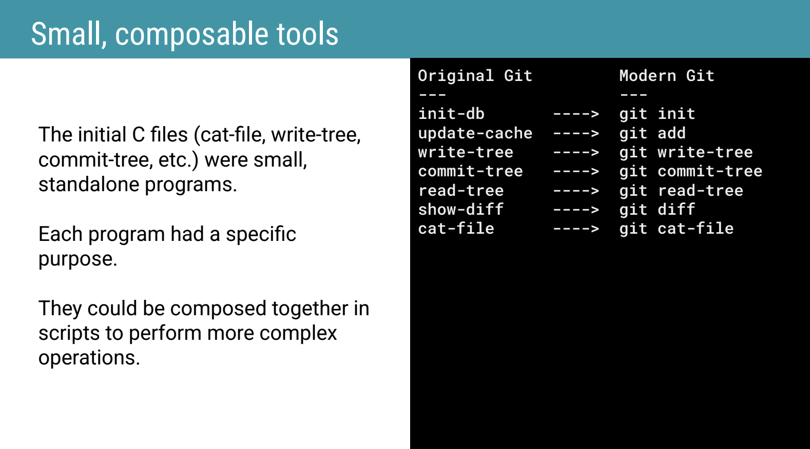

# Inside the first Git commit: powerful ideas behind a minimal start

> **Talk Abstract**
>
> In this talk, we will dissect the first Git commit by Linus Torvalds and uncover the powerful software design principles embedded in its earliest code.
> We will explore how Git's choice of data structures (like immutable content-addressed blobs and trees) laid the foundation for reliability, correctness, and performance.
>
> We will also highlight how Git is a brilliant embodiment of Unix philosophy: small, composable tools; reliance on the filesystem; text-based formats; and simplicity in interface with power in composition.
> Even in its minimal form, Git introduced key operations such as SHA-1 hashing, snapshot storage, and a filesystem-based object database that collectively reflect deep design clarity.

Speaker: Valentin Rusev
* [GitHub repository (Git reimplemented in PHP)](https://github.com/valentinboyanov/git-symfony/)
* [Slides](https://drive.google.com/file/d/16wsjl9W5Q3iMtvDqq3nRKchG-_ZnkzEQ/view)

## Recap

Valentin Rusev's talk takes inspiration from Renaissance architects who studied ancient Roman buildings to understand the principles behind their longevity.
In the same spirit, it dissects Git's very first commit to uncover the design ideas that have made it the cornerstone of modern software development for over 20 years.
The first commit was 10 days of coding, 11 files, and 1,244 lines of C — a small codebase that already contained the seeds of a revolutionary version control system.

### The origin story

Git was not born out of a desire for a new toy.
In 2005, the Linux kernel team lost access to BitKeeper, their version control system at the time.
Linus Torvalds decided to write his own, with three non-negotiable goals: it must be fast, distributed, and reliable.
Notably, he prioritised correctness in the core model first; developer usability came later.

### Git is a content-addressable filesystem

The most important idea to take away from the talk is this: **Git is not primarily a version control system — that is just the application built on top of it.
At its heart, Git is a content-addressable filesystem.**

Rather than storing deltas or diffs like older version control systems, Git stores snapshots.
Every piece of content saved in Git becomes an object, and that object's identity — its ID — is derived from the content itself via SHA-1.
If you change even one character in a file, Git creates a new object with a different ID; the old object stays untouched.
This is what gives Git its integrity guarantee: you cannot change the content without changing the address.

### The three building blocks

Git's object model rests on three simple types:

**Blob** — the *what*.
A Blob holds the raw content of a file: the text, the code, the binary data.
It has no name and no date — only the content, plus a header with the object type, a space, the size, a null byte, and then the binary data.

**Tree** — the *where*.
A Tree is like a directory listing: it maps file names to the Blob IDs that hold their content.
Trees can also point to other Trees, making it possible to represent an entire project's directory structure in a single root Tree.

**Commit** — the *who*, *why*, and *when*.
A Commit ties everything together to form the history.
It holds a pointer to a Tree (the snapshot of the entire project at that moment), a pointer to the previous Commit (forming the chain that is the project's history), and the author's name and message.

### The Index: the staging area

The Index — originally called the "current directory cache" (which is why the initial repository directory was `.dircache`) — is the staging area that we still use today.
It was present from the very first commit, and it is one of Git's most powerful features: it gives precise control over what goes into each Commit, acting as a factory that lets you craft a clean, intentional commit out of a messier working directory.

### Unix philosophy: small, composable tools

Linus Torvalds also created Linux, and Git reflects Unix philosophy deeply.
The first commit was not a single monolithic program but a toolkit of standalone executables, each doing one job well.

Each original tool maps directly to a modern Git subcommand: `init-db` became `git init`, `update-cache` became `git add`, `write-tree` became `git write-tree`, `commit-tree` became `git commit-tree`, and so on.
The composability of these small tools allowed people to build workflows on top of them that Linus never anticipated — including, as he mentioned in a 20th anniversary interview, many features he still does not use himself.

### Git's database is the filesystem

Another Unix idea embedded in Git from day one: rather than using a custom binary database, Git stores all its objects as plain files on the filesystem, inside `.dircache` (later renamed `.git`).
This transparency is a feature, not an accident.
You can open the `.git` folder, navigate the `objects` directory, copy files, back them up, or inspect them directly.
There are no secrets.
The two-level directory structure under `objects/` (splitting by the first two hex characters of the SHA-1) is a deliberate performance choice: concentrating all objects in a single directory would slow down filesystem lookups.

### Demo: Git reimplemented in PHP

To make the first commit accessible without wrestling with a 20-year-old C codebase, Valentin reimplemented it in PHP using Symfony's Console and Filesystem components.
The project lives at [github.com/valentinboyanov/git-symfony](https://github.com/valentinboyanov/git-symfony/) and mirrors the original structure: a `bin/git-symfony` entry point, one Symfony Console command per original tool, and the index management logic under `src/Index`.

The live demo walked through the full workflow: initialise a repository (`init-db`), create a file and add it to the cache (`update-cache`), inspect the staging area (`show-diff`), create a Tree (`write-tree`), create a Commit (`commit-tree`), inspect the resulting object (`cat-file`), modify the file, stage it again, and create a second Commit that references the first as its parent — illustrating how the chain of history is built.

### Gall's Law in action

The talk closes with a reflection that applies well beyond Git: this is a near-perfect illustration of **Gall's Law**, which states that every complex system that works evolved from a simple system that worked.
Git's design was so clear and so correct from the start that it could scale from a personal Linux kernel tool to the version control system used by virtually every software project in the world.
The first commit is small enough to be studied in an afternoon — a rare gift from software history.
