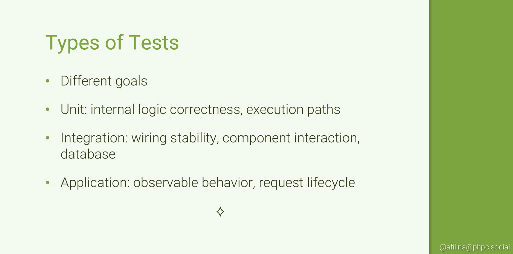
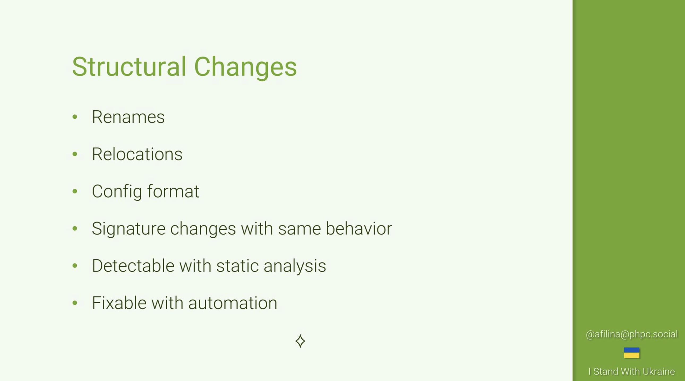
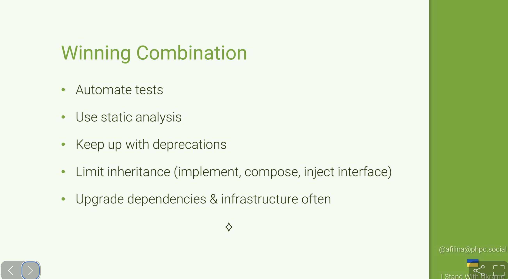

# Surviving a Symfony Upgrade

> **Talk Abstract**
>
> Symfony is evolving and you may ask yourself whether your application can keep up.
> This presentation aims to show coding techniques and design patterns
> that will make future Symfony upgrades much easier,
> even if we don't know what the future holds!

Speaker: Anna Filina
* [Mastodon profile](https://phpc.social/@afilina)
* [SpeakerDeck slides](https://speakerdeck.com/afilina/surviving-a-symfony-upgrade)

## Recap

Anna Filina's talk reframes the Symfony upgrade question: rather than listing specific deprecations,
it focuses on the methodology and mindset that determine whether an upgrade takes ten minutes or several years.
The core message is that the upgrade work happens long before you bump the version number.

### What affects the upgrade effort

The time an upgrade takes is a function of several variables: the gap between the old and new version,
which features were removed or deprecated, how tightly coupled the application is to Symfony internals,
how much automation (tests and tooling) is in place, and how neglected the surrounding environment is.
That last one is often overlooked: if PHP itself hasn't been kept current,
a Symfony upgrade becomes a compound upgrade, and old infrastructure (TLS versions, server constraints)
can surface as additional blockers.

The PHP templates removal in Symfony 5 illustrates the stakes.
The feature was deprecated in 4.3 with a clear deprecation notice, giving roughly six months of warning before 5.0.
A follow-up blog post added one more month.
For large applications, rewriting all templates is easily a multi-month effort,
so "six to seven months" is not much runway.
The lesson: stay plugged in to the Symfony blog and community so you catch those signals as early as possible.
Symfony's predictable release cadence - a minor version every six months, a major every two years - is what makes this planning tractable.
It is worth appreciating how far the ecosystem has come: the combination of cyclic releases, first-class deprecation notices, and purpose-built tooling gives developers a reliable rhythm that simply didn't exist in earlier PHP frameworks.

### Types of tests and what they catch

Automated tests are the single most reliable early-warning system for an upgrade.
No single type of test is better than the others; each has a distinct role, and you need all of them.
Unit tests protect business logic, integration tests validate framework wiring, and application tests confirm observable behaviour.
Treating any one tier as sufficient is the gap that makes upgrades painful.

**Unit tests** cover internal logic and all execution paths through mocks,
but they deliberately bypass the framework, so they will not detect that an interface was removed
or a method signature changed on a Symfony class.

**Integration tests** target wiring stability: they boot the actual kernel, load real configuration,
and exercise how your code interacts with Symfony's service container, templating system, or database layer.
Symfony provides `KernelTestCase` for exactly this: boot the kernel, fetch a service from the container, call it.
This is where the majority of upgrade errors surface, because assumptions about how the framework behaves can change.

**Application tests** sit at the HTTP level, exercising the full request lifecycle.
They verify observable behaviour (response codes, response bodies, emails sent, files written)
without caring about internal details.
They also allow testing multi-step scenarios such as a file upload followed by a form submission.

For console commands, `CommandTester` fills the same role: boot the kernel, wrap the command,
execute it, and assert on the output and exit code.
Having tests that cover all three levels means running the test suite after bumping the version
immediately surfaces both structural and behavioural regressions.

### Example: Command return types and automation tools

The `Command::execute()` return type story is a good illustration of how Symfony manages breaking changes over time.
Before Symfony 7, the method had no declared return type, so returning a numeric string or even `null` would work.
In 7.0, a strict `int` return type was enforced.
This was not a surprise: the change was flagged in 4.4 and supported by a tool called `patch-type-declarations`.

`patch-type-declarations` scans the codebase, inspects `@return` annotations and parent signatures,
and can automatically add the missing native type declarations to child classes.
When upgrading from a very old version it effectively patches the signatures for you.
Note that it only fixes the signature, not the body of the method.

For structural changes like these, IDE code actions and dedicated refactoring tools help.
Most modern IDEs offer syntax-aware search-and-replace that understands PHP syntax rather than raw text;
PHPStorm's **"Replace Structurally"** is one example: it correctly captures complex arguments
(nested parentheses, multi-line expressions, docblock-embedded calls) and rearranges them safely.
**Rector** goes further: it refactors PHP code based on configurable rules.
Ready-made rules exist for Symfony and PHP version upgrades,
but you will likely need to write custom ones for application-specific patterns.
The learning curve is real; the payoff is that one well-written rule can automate weeks of manual work.

Since Symfony 7.3, commands no longer need to extend `Command` at all.
A plain class with `#[AsCommand]` and an `__invoke()` method is sufficient,
with `#[Argument]` and `#[Option]` attributes on the parameters.
Symfony 7.4 extended this to the standalone Console component.
The result is classes that are decoupled from the framework,
easier to unit test, and straightforwardly portable.

### Structural versus semantic BC breaks

Anna draws a useful distinction between two categories of backward-compatibility break.

**Structural changes** are visible in the API: renames, namespace relocations,
configuration format changes, or signature changes where the behaviour stays the same.
They are detectable with static analysis (PHPStan, Psalm, IDE inspections)
and often fixable with automation (`patch-type-declarations`, Rector, SSR in PHPStorm).

**Semantic changes** are subtler: the signature stays the same but the behaviour changes,
or a new validation rejects input that was previously accepted,
or events fire in a different order.
A concrete example from the talk: `Request::query->get()` in Symfony 5 accepted an array as the default value
(thanks to PHP's type juggling); Symfony 6 added validation that rejects it.
Another: `checkIp4` in 5.3 returned a string when it should have returned a bool,
with potential security implications for code that tested `if (!is_string($result))`.
Semantic breaks are detectable at runtime with a solid test suite,
but they are difficult to fix automatically because the tool cannot infer the developer's original intent.

Symfony's backward compatibility promise is directly relevant here:
interfaces are guaranteed stable across minor versions unless marked experimental or internal,
or unless a security fix requires otherwise.
Injecting interfaces rather than concrete classes is therefore both a design best practice
and an upgrade risk-reduction strategy.

### The winning combination

The talk closes with a checklist.
**Automate tests** across all three levels: unit, integration, and application.
**Use static analysis**: PHPStan, Psalm, or even your IDE's built-in inspections.
**Keep up with deprecations**: log them, read them, and address them incrementally on each minor version
rather than accumulating them until a major upgrade forces a reckoning.
**Limit inheritance**: implement interfaces, favour composition, and inject interfaces rather than concrete classes.
**Upgrade everything**: PHP, infrastructure (server, TLS), and other dependencies alongside Symfony.
Falling behind on all fronts at once is how a version bump turns into a multi-year project.

The overarching principle is to spread the effort continuously rather than batch it into a big-bang upgrade.
If you address each deprecation notice as it appears, each major version boundary is a small step rather than a cliff.
