# The Symfony TUI Component

> **Talk Abstract**
>
> With the migration of coding agents from the IDE to the terminal,
> TUIs (Text User Interfaces) are experiencing a genuine renaissance.
> This session introduces the new Symfony Terminal component,
> a fully PHP-built TUI toolkit.
> We explore its architecture, the primitives it exposes,
> and how it enables building rich, interactive terminal interfaces within Symfony applications.
> Don't miss the opening of the pull request live on stage!

Speaker: Fabien Potencier

## Recap

Fabien Potencier opens the talk in the most appropriate way possible:
the presentation itself runs inside the terminal.

Not PowerPoint, but **Terminal Point** - a TUI application built with the very component he is about to introduce, complete with scrolling character-rain animations and transparency effects between layers.

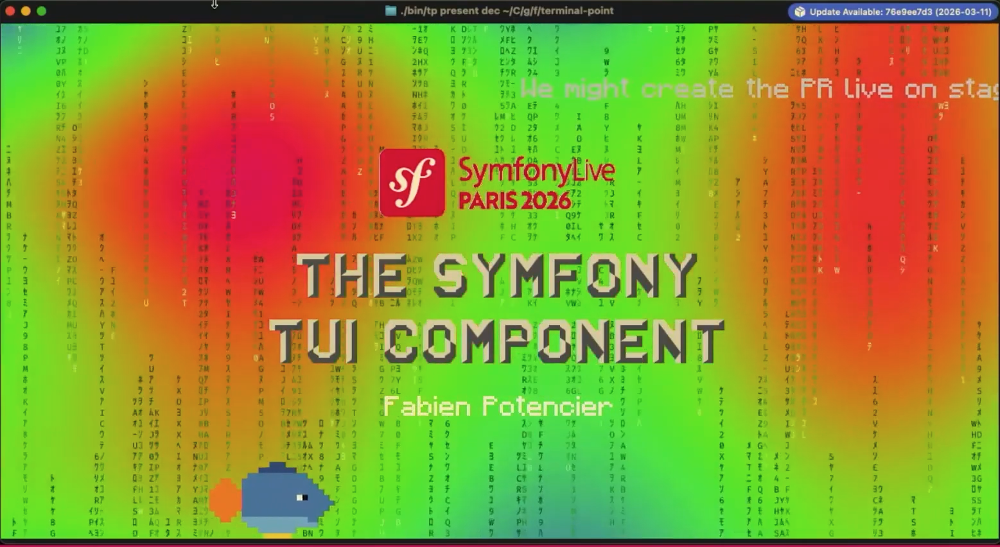

### A talk three years in the making

This is the second time Fabien has attempted this keynote.
Three years earlier, at SymfonyCon Brussels, he demoed a Terminal component and then quietly set it aside.

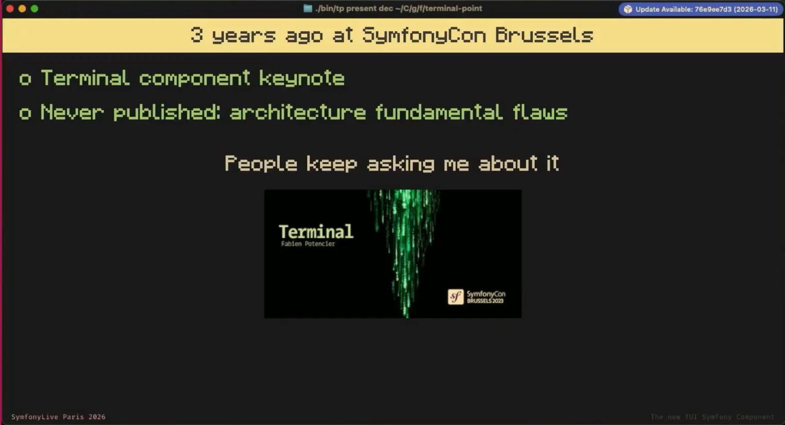

A week or two before that presentation, he found a fundamental architectural flaw in how he was handling rendering - something that would never hold up in production over time.
He preferred not to publish it.

The renewed motivation came from LLMs and coding agents.
When coding agents moved into the terminal, he wanted to build one in PHP - which meant he needed a solid TUI library.
That library became the prerequisite that finally justified starting from scratch.

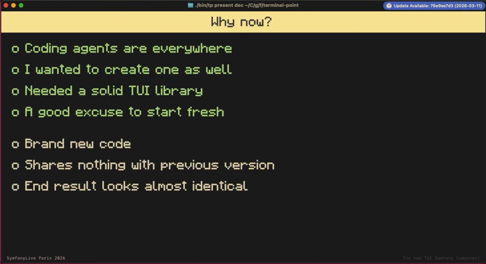

The new component shares **nothing** with the previous attempt - not a single line of code, not even the namespace.
It is also the first Symfony component where he relied heavily on LLMs during development.
The code was reviewed; the tests, somewhat less so.

### Splitting the Console component

The Symfony Console component is one of the oldest in the framework - shipped with Symfony 2.0 in 2011, 15 years of production use, powering much of the PHP ecosystem.

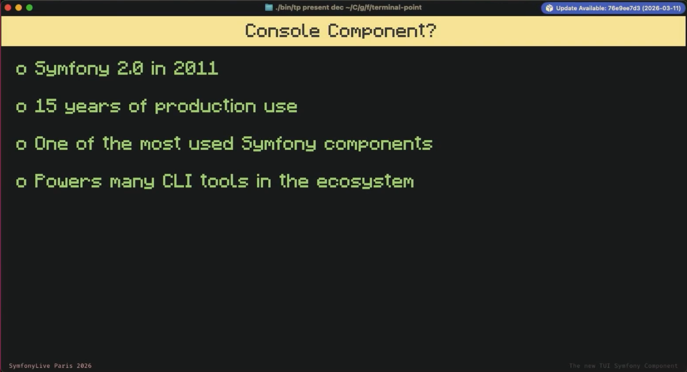

But looking closely, it handles two distinct concerns.

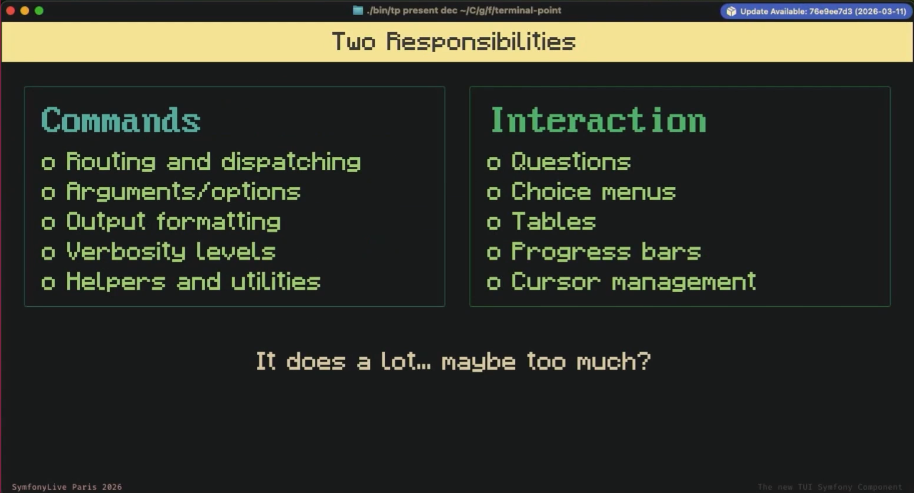

On one side: routing and dispatching commands, parsing arguments and options, output formatting, verbosity levels, helpers and utilities.
On the other: questions, choice menus, tables, progress bars, cursor management.
It does a lot - maybe too much.

The proposal is to split those responsibilities cleanly.

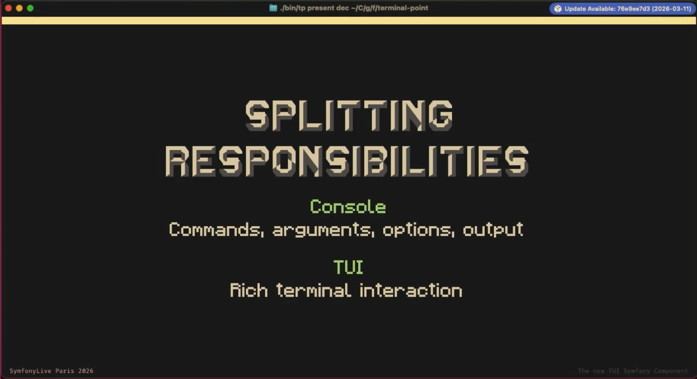

**Console** keeps what it already does well: commands, arguments, options, output.
**TUI** takes over everything that is rich or interactive.

### A layout engine inspired by CSS Flexbox

The most fundamental piece of the new component is its layout engine.

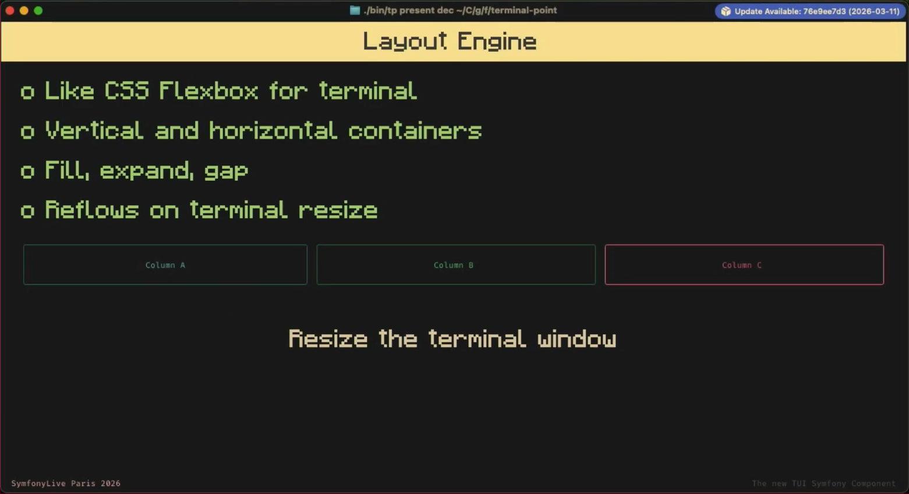

A terminal is naturally line-based and vertical.
Horizontal composition is non-trivial.
The TUI layout engine brings CSS Flexbox semantics to the terminal: vertical and horizontal containers, fill, expand, gap, and automatic reflow when the terminal is resized.

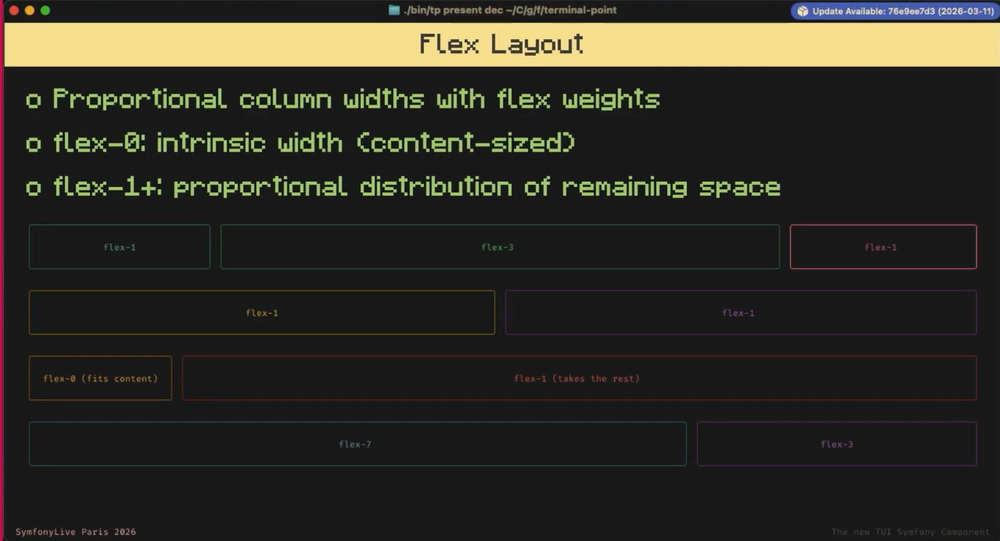

`flex-0` sizes a column to its content.
`flex-1` and above distribute the remaining space proportionally.
The familiar mental model from web development transfers directly.

### Three ways to style

Styling works in three modes.

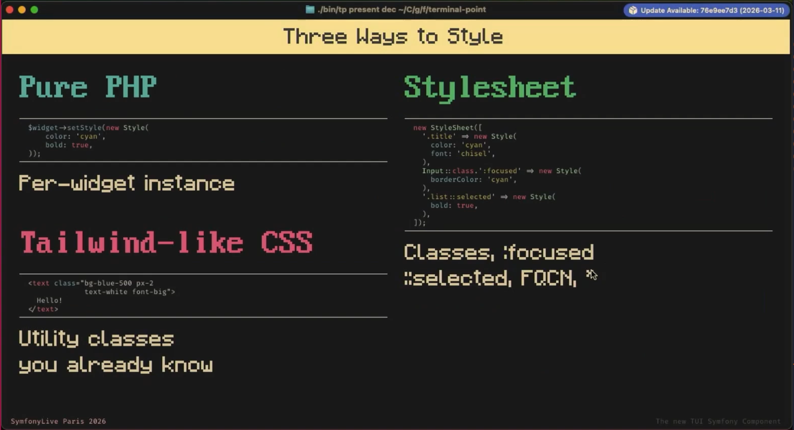

**Pure PHP** sets styles directly on widget instances - verbose, but explicit.
**Tailwind-like CSS** allows utility classes on template elements: `bg-blue-500 px-2 text-white font-big`.
**StyleSheet** is the most powerful: a separate object where selectors, inheritance, pseudo-classes like `:focused` and `::selected`, and FQCN targets all work as expected.

The stylesheet ships with sensible defaults.
It supports the same kind of state-based styling web developers already know: a widget with focus can have a different background and text colour than when it is unfocused.

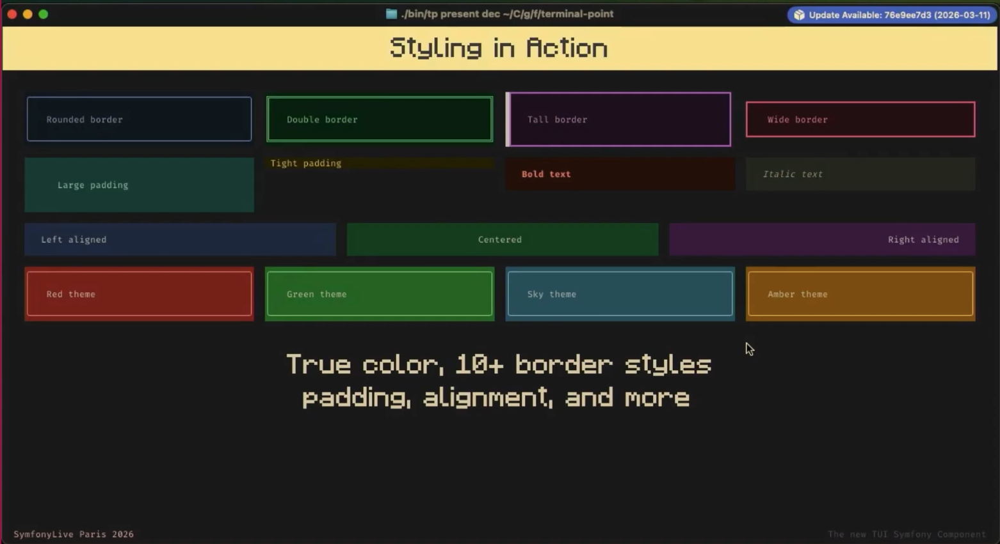

True colour, more than ten border styles, padding, and alignment are all available.

### Responsive breakpoints

The component supports breakpoints on terminal width, behaving exactly like CSS `@media (min-width: ...)`.

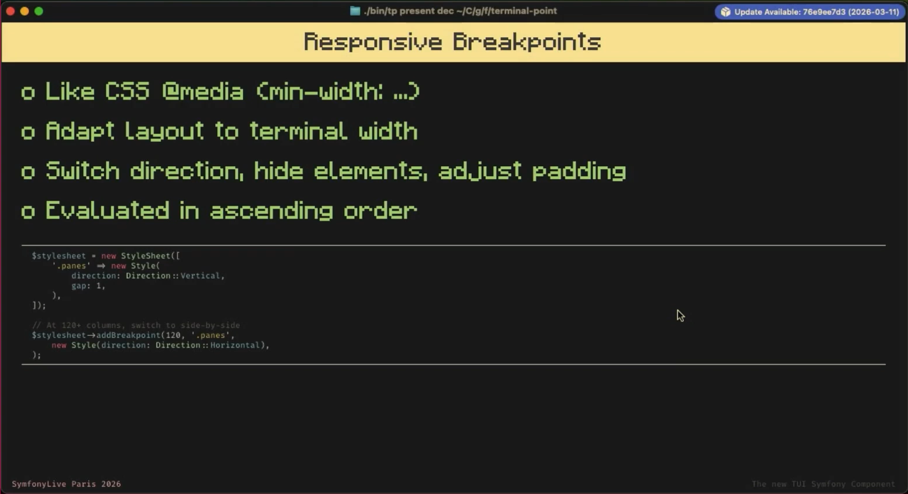

A layout with two side-by-side columns at 120 characters wide can automatically collapse to a vertical stack at narrower widths.
Direction, visibility, and padding can all change at breakpoints.
Breakpoints are evaluated in ascending order.

### Figlet fonts and Twig templates

Text rendering supports Figlet fonts - simulated large typography constructed entirely from terminal characters.

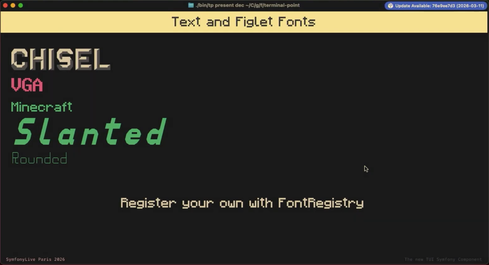

Custom fonts can be registered through a `FontRegistry`.

Widget composition can be done in pure PHP, or in Twig templates.

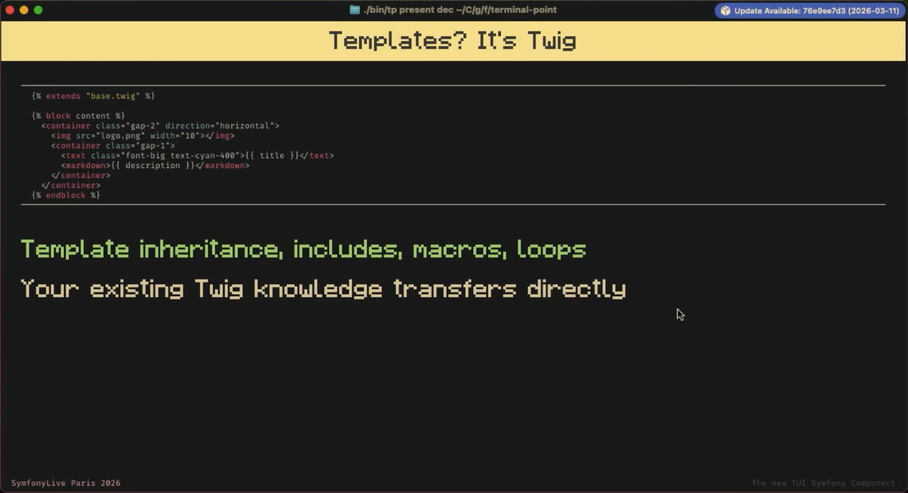

Every built-in widget has a corresponding Twig tag.
Template inheritance, includes, macros, and loops all work as expected.
Existing Twig knowledge transfers directly.

### Built-in widgets

The component ships with a wide set of composable widgets.

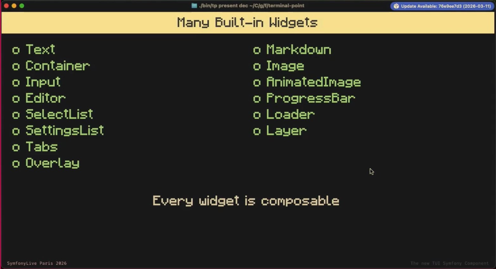

`Text`, `Container`, `Input`, `Editor`, `SelectList`, `SettingsList`, `Tabs`, `Overlay`, `Markdown`, `Image`, `AnimatedImage`, `ProgressBar`, `Loader`, and `Layer`.
Every widget is composable - a container can hold an input, an editor can sit inside another container, and so on.
Not all of them will ship in the first public release, but they all work locally.

**Input** behaves like a full text field: word-by-word navigation with Alt, Ctrl-W to delete a word, Home/End, and all the standard readline shortcuts.
Focus is visible through stylesheet-driven styling.

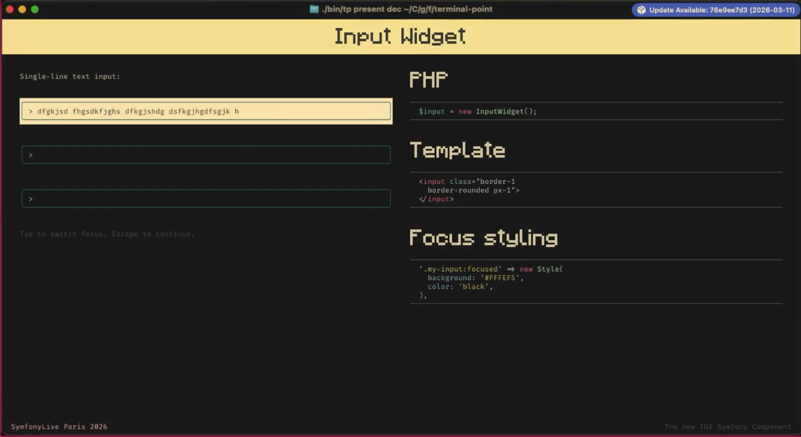

**Editor** is the multi-line counterpart, with undo/redo, selection, and a built-in pager when height is constrained.

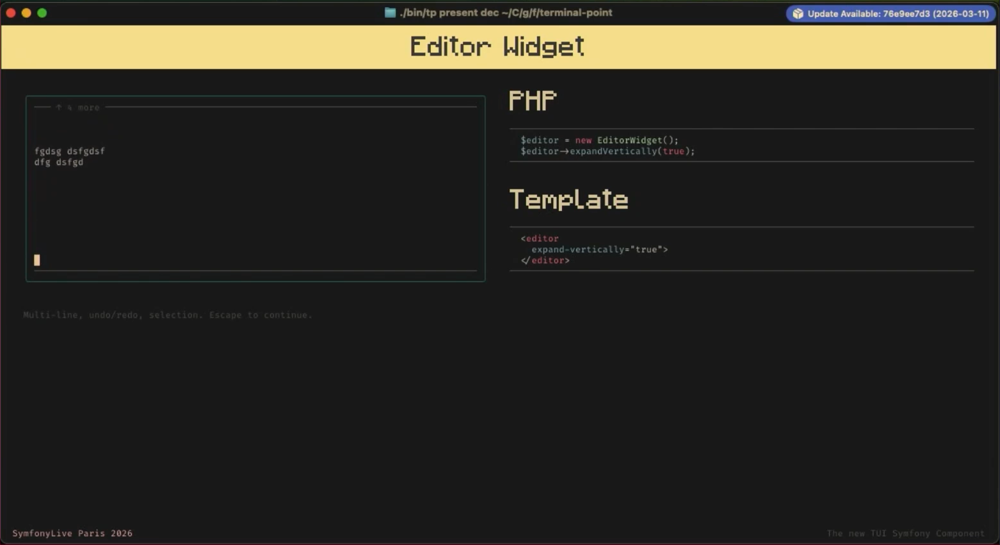

**SelectList** supports a `max-visible` limit with keyboard navigation.
Constructor parameters map directly to template attributes.

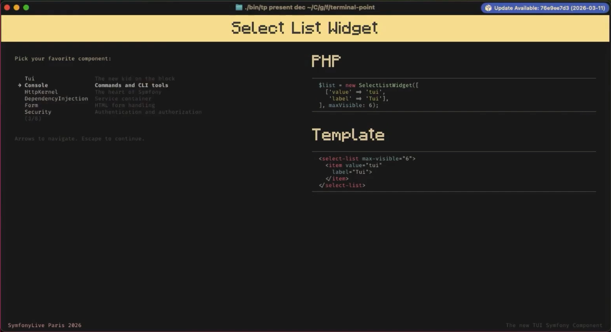

**Markdown** renders Markdown directly in the terminal, including bold, italic, inline code, lists, and blockquotes - powered by Tempest Markdown under the hood.

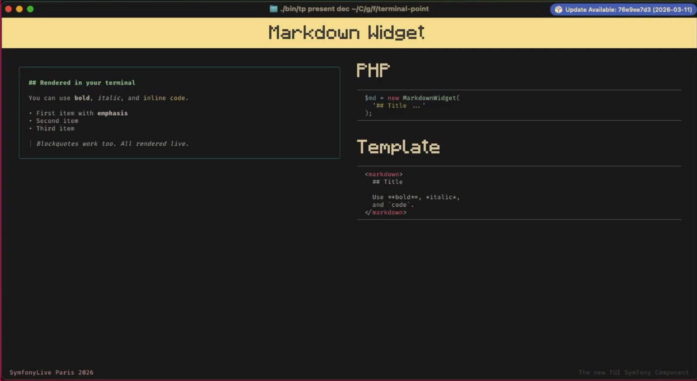

Composing an Editor with a Markdown widget produces a live Markdown editor with a side-by-side preview, updated in real time.
The implementation takes roughly ten lines of code.

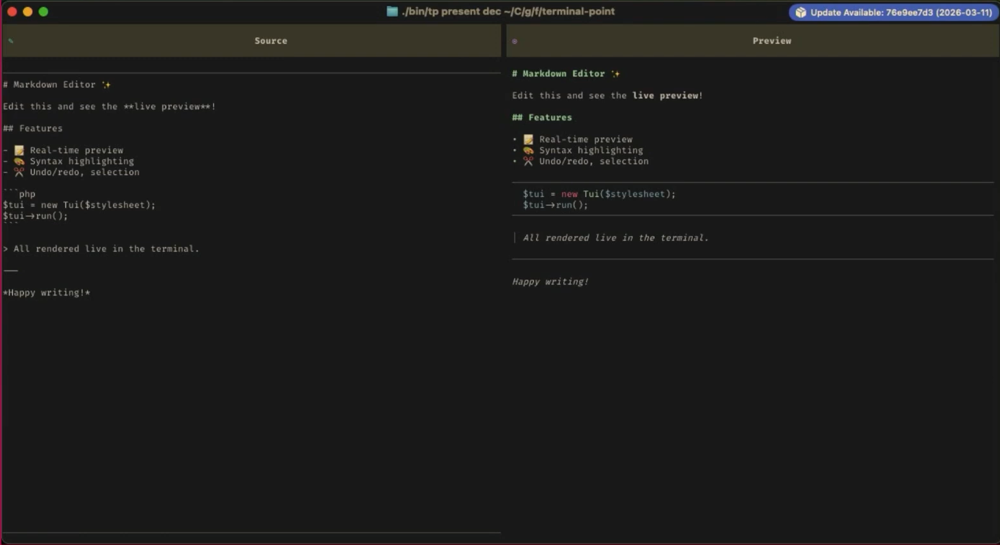

**Overlay** renders modals, popups, dropdowns, and tooltips floating above the main widget tree.
It supports nine anchor positions, configurable width, `maxHeight`, margins, and offsets, and dismisses when clicking outside.

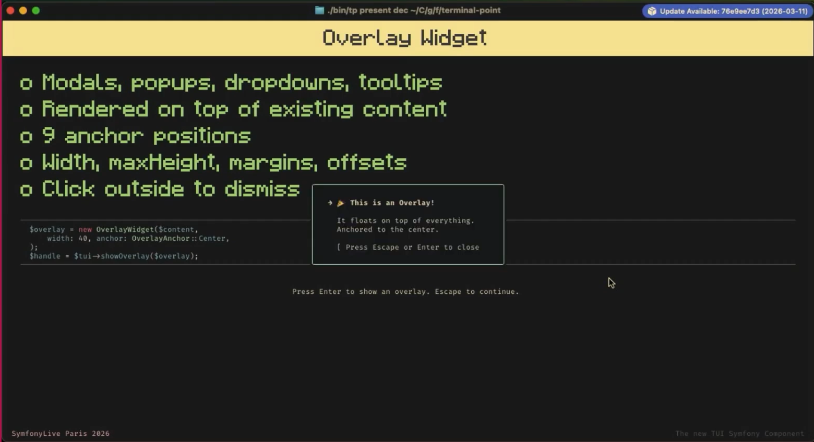

**Image** displays PNG, JPEG, and GIF images directly in the terminal using the Kitty graphics protocol.
On terminals that do not support the protocol, the image is automatically degraded to ASCII art.

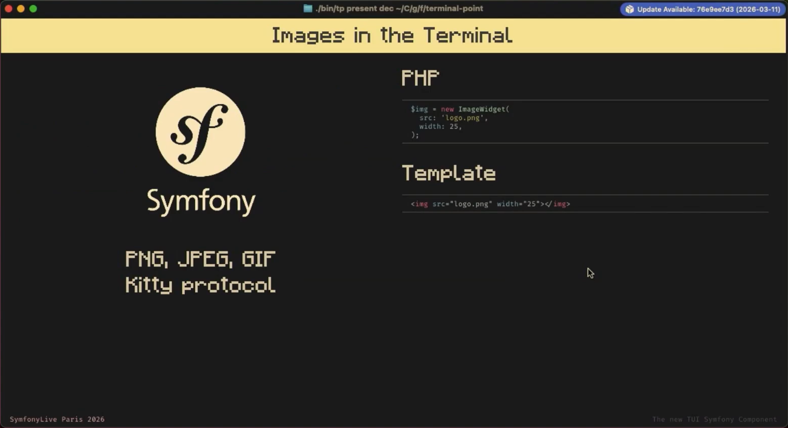

**AnimatedImage** renders animated GIFs frame by frame.
For maximum quality, it uses Unicode half-block characters (▀ and ▄) to double the effective vertical resolution, and finer-grained Unicode shapes (triangles and sub-blocks) to approximate pixel-level detail.

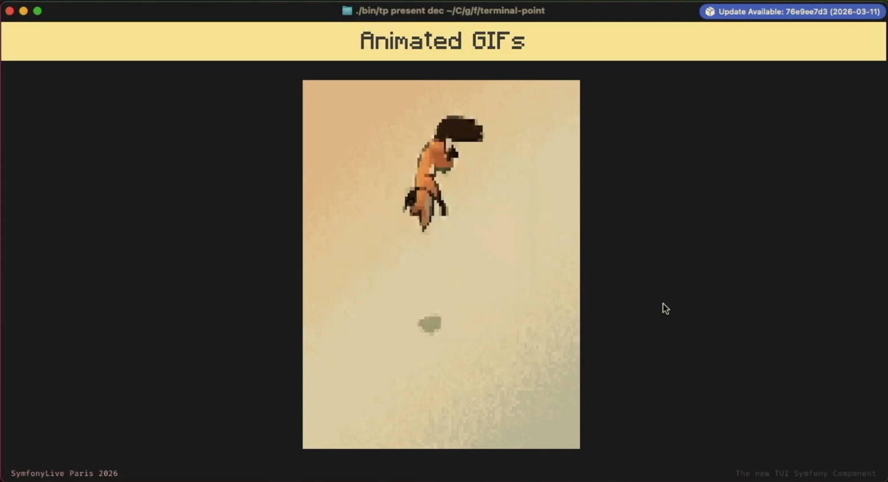

### Custom widgets and template tags

Any PHP class can become a widget.
Registering a namespace prefix makes it available as a Twig tag, with the same attribute-to-constructor-parameter mapping as built-in widgets.

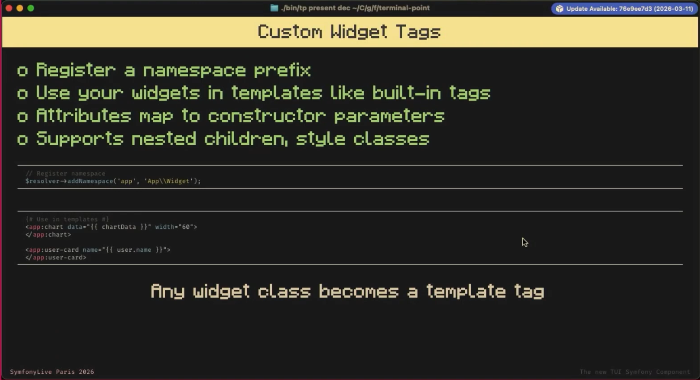

### Events and focus

Widget interaction is built on the Symfony EventDispatcher.

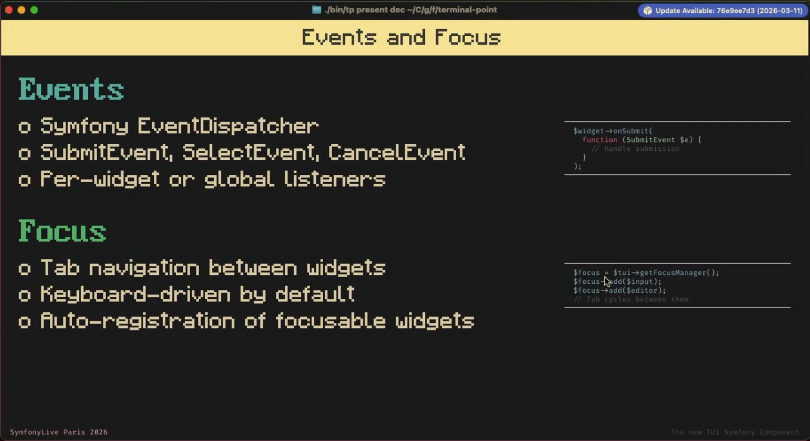

Three core events cover the common cases: `SubmitEvent`, `SelectEvent`, and `CancelEvent`.
Events can be listened to globally on the `Tui` root object, or scoped to a specific widget by ID - exactly like `document.getElementById` in the browser.

Focus management is automatic.
Tab navigation moves between focusable widgets.
The currently focused widget receives all keyboard input.
Any widget class that implements the focusable interface is automatically registered in the tab order.

### Keybindings

Terminal key handling is notoriously complex: there are old encoding schemes, new ones, poorly documented variations, and modifiers like Shift and Ctrl that interact in non-obvious ways.

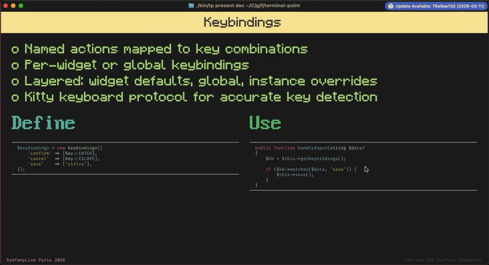

The TUI component abstracts all of this.
Application code works with named actions - `save`, `quit`, `cancel` - and maps them to key combinations once.
The Kitty keyboard protocol is used for accurate key detection on modern terminals.
Bindings are layered: widget defaults, global application bindings, and per-instance overrides.
Default keybindings will be standardised so that all Symfony TUI applications share the same shortcuts.

### Mouse support

Mouse support is implemented but ships as an opt-in feature.

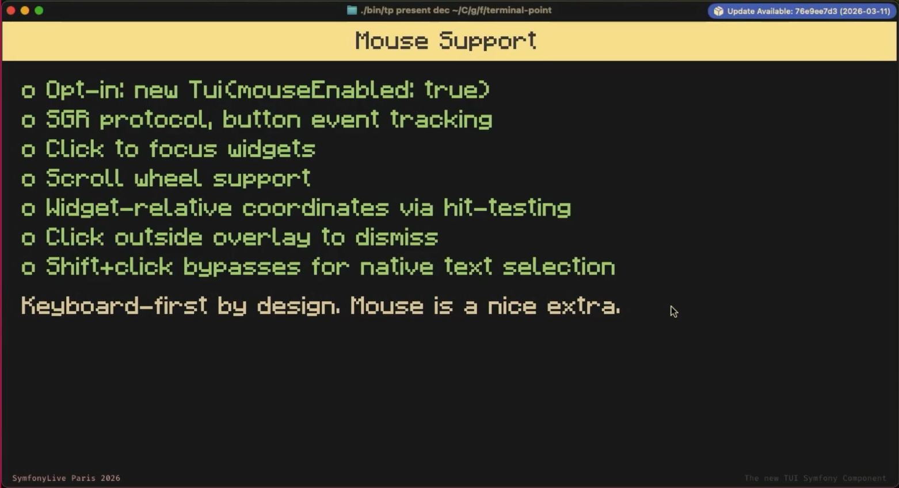

Enabling it activates the SGR mouse protocol, which intercepts all terminal mouse events - including scroll.
That trade-off means losing the native terminal scrollbar.
When active, widgets report their screen coordinates via hit-testing, allowing clicks to transfer focus, scroll events to navigate lists, and Shift-click to restore native text selection.

The component's broader philosophy is to delegate to native terminal capabilities wherever possible - real scrollbar, real hardware cursor, real scroll history.
Mouse support is the deliberate exception.

### Powered by PHP Fibers and Revolt

The runtime model is what makes everything non-blocking.

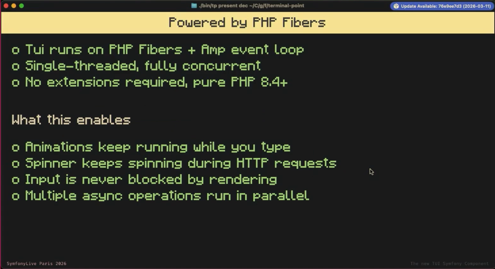

The TUI runs on PHP Fibers combined with the Revolt event loop - the shared foundation underneath both Amp and ReactPHP.
The result is single-threaded, fully concurrent execution with no C extensions required: pure PHP 8.4+.

Animations keep running while the user types.
Spinners keep spinning during HTTP requests.
Input is never blocked by rendering.
Multiple async operations run in parallel.

The render loop is adaptive: up to 100 frames per second when there is activity, dropping to approximately 4 frames per second when the screen is idle.
At complete rest - nothing typed, nothing animated - CPU usage is zero.

Blocking operations are incompatible with this model.
The Symfony Process component blocks; it cannot be used.
Symfony HTTP Client blocks; Amp's HTTP client must be used instead.
A blocked fiber freezes the event loop: the spinner stops, and more critically, user input stops being processed.

### Rendering pipeline

The rendering pipeline operates on lines - the natural primitive of a terminal.

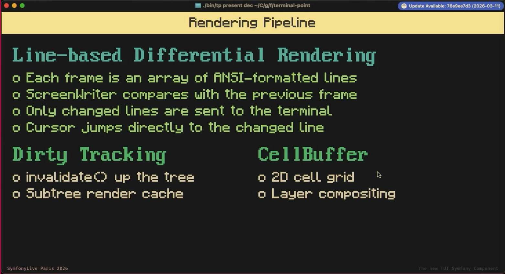

At each tick, the pipeline computes the full widget tree, assembles it into a sequence of ANSI-formatted lines, and compares them against the previous frame.
Only the lines that changed are sent to the terminal.
The cursor jumps directly to each changed line, updates it, and returns.

**Dirty tracking** propagates invalidity upward through the widget tree.
Changing one widget does not invalidate everything above it - only the ancestors actually affected by the change are re-rendered.

**CellBuffer** is the 2D grid mode used for layer compositing.
It handles overlays and transparency: the character-rain animation on the title slide passes visually through the letters behind it because those layers are composited via the cell buffer.

### Stress testing with games

To find the limits of the renderer, Fabien built games.

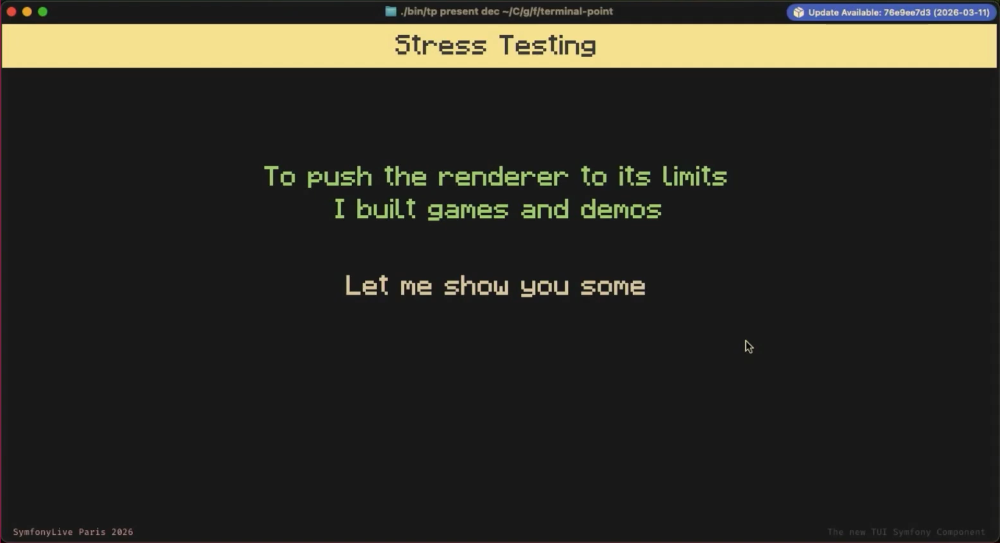

The 2048 implementation runs with large, styled tiles - stress-testing colour rendering and large-cell layouts.

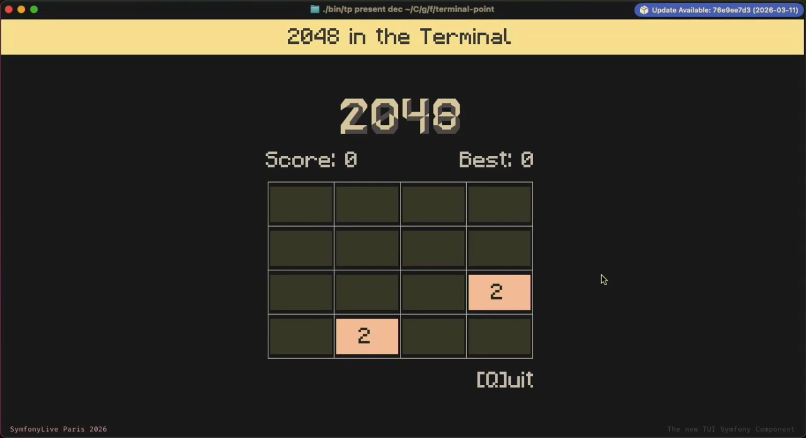

Tetris follows, with real-time piece movement, rotation, scoring, and game-over detection.

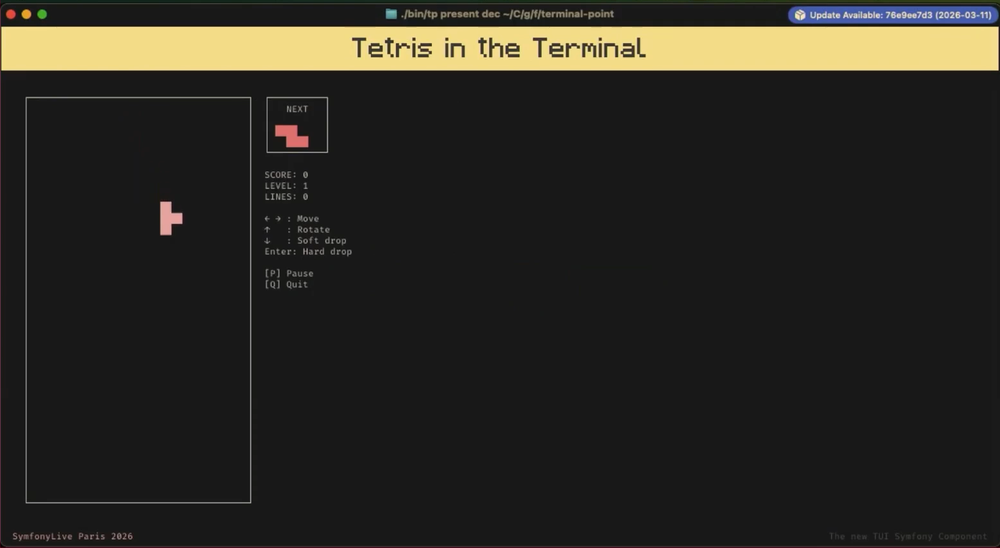

No significant rendering limits were found.

### One last thing: the live pull request

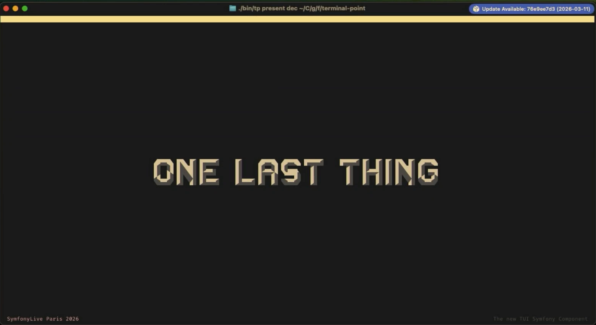

The abstract promised a live pull request to the Symfony repository.
Fabien delivers.

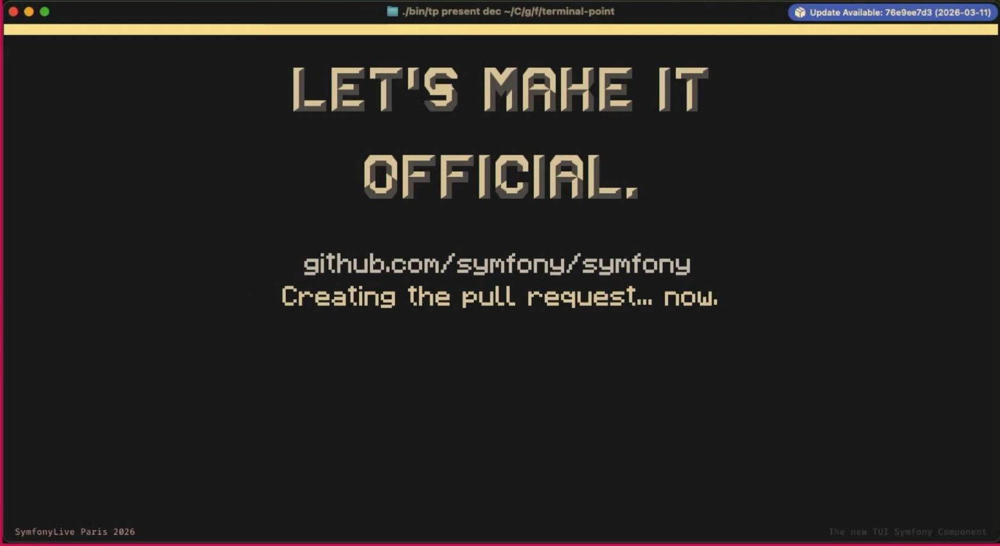

From the terminal - naturally - he pushes a branch, follows the link that `git push` prints, and opens the PR against `symfony/symfony` with 29 files, documentation included.

The component ships as experimental.
For future contributions, Fabien proposes an experiment: instead of submitting pull requests, write a well-specified prompt describing the desired feature.
He will run the prompt himself and pay the tokens.
